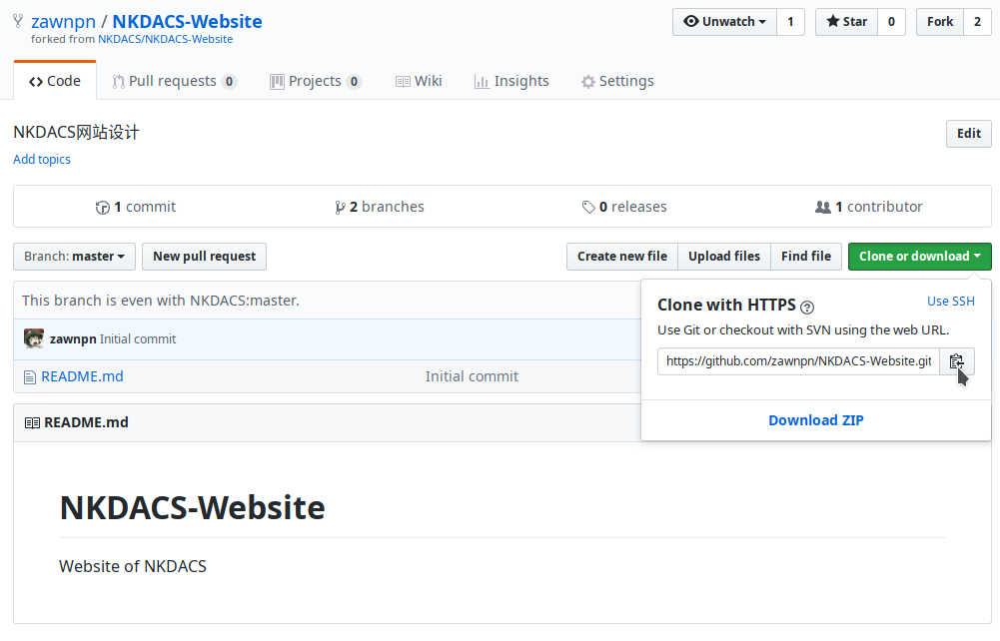
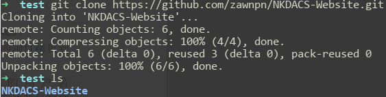
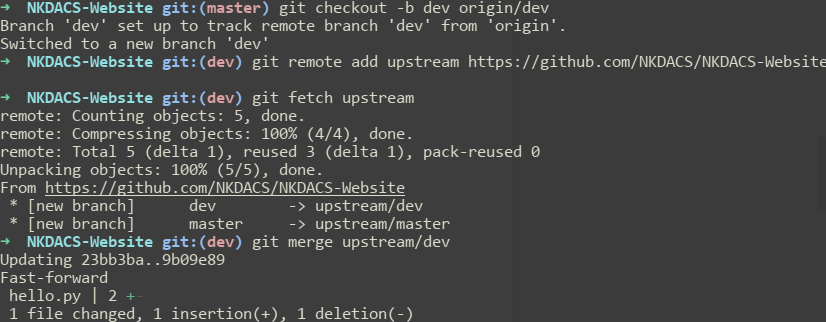
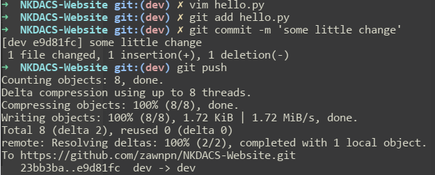
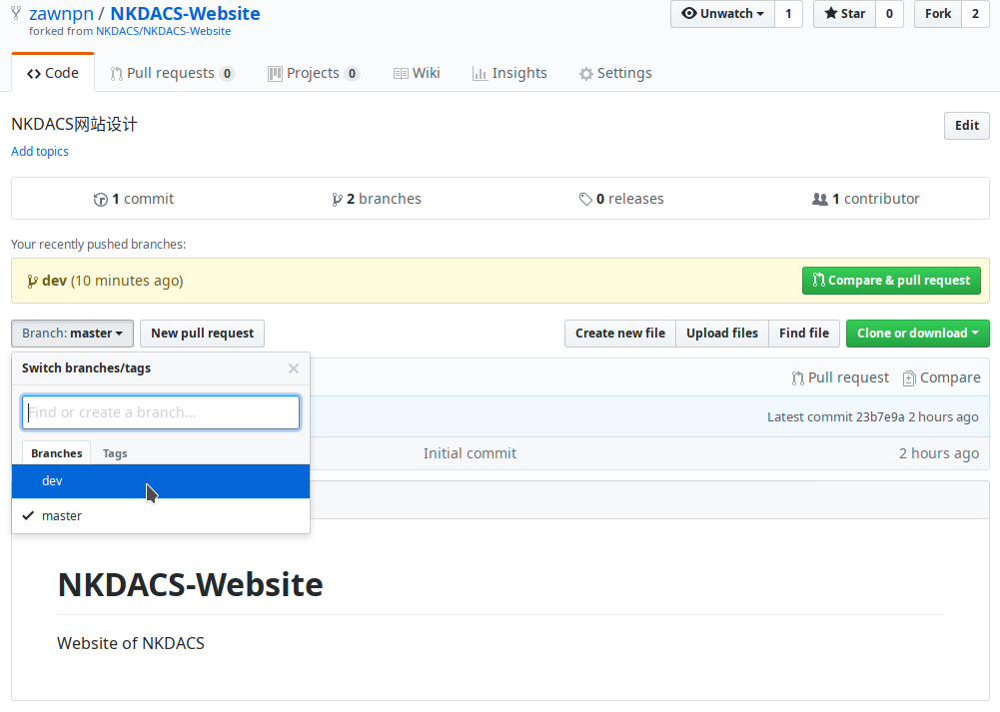
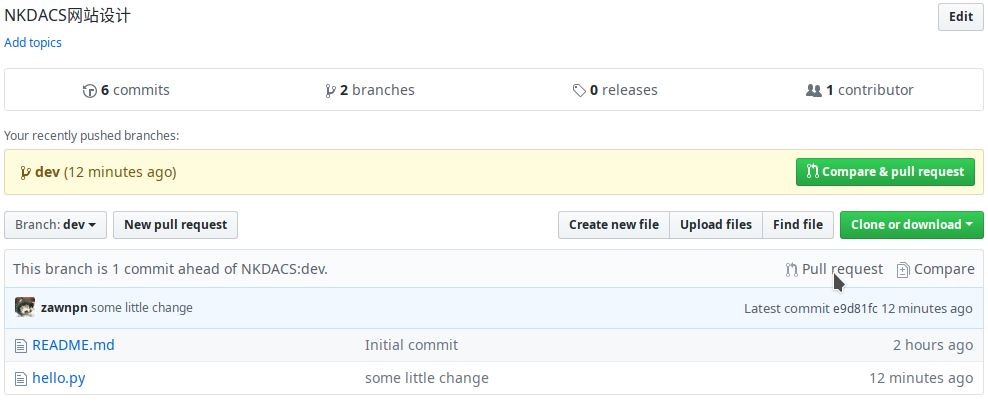
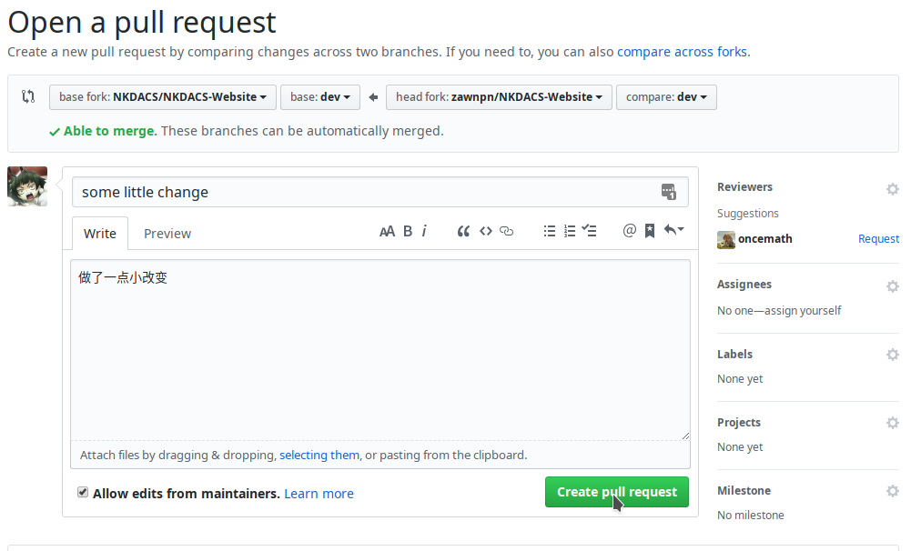

# NKDACS-Website
NKDACS网站开发说明

## 简要说明
本次网站的开发，考虑到网站实际情况和规模，计划使用基于Python的Flask框架进行后台设计，使用Bootstrap框架进行前端开发，使用Python自带的sqlite3进行数据管理。请各位负责不同部分在空闲时间做好充分准备。

本次的开发过程，打算采用业界常用的git工具来进行协同开发，考虑到便利性，决定直接使用Github而不是自建git服务器。

考虑到部分同学可能对git了解生疏，所以下面将简要说明一下这次开发过程中，关于使用git所需要注意的一些东西。

## git协同开发的简要说明

### 进入NKDACS组,做好初步准备
1. 还没有Github的同学，请自行注册一个账号。然后在群里联系负责人，将会邀请你加入[NKDACS项目组](https://github.com/NKDACS)
2. 在项目组页面下，点击项目`NKDACS-Website`，点击右上角的`Fork`按钮，这一步会把项目组的项目拷贝到自己账号下面

### 将项目Clone到本地计算机
1. 进入你自己账户下的`NKDACS-Website`(`https://github.com/你的用户名/NKDACS-Website`)，点击一下`Clone or download`，再点击下面那个链接右边的复制按钮(在鼠标指着的位置，或者直接复制那串地址也可)

2. 在终端输入命令`git clone 复制的链接地址`(例如 `git clone https://github.com/你的用户名/NKDACS-Website.git`)

3. 此时发现，已经自动拷贝了一个文件夹在你当前目录下，这个文件夹就是当前已有的项目文件(可能网络速度有点慢，请耐心等待clone完成，或者有能力的话请“翻墙”使用github)

### [重要]分支选择、添加上游(就算不懂也无所谓，照着下面的命令做就行)
第一次做好上面这些步骤后，终端内切换进目录。不要着急，务必记得，要切换分支、添加上游、获取最新版！(下面这几步不理解也没关系，每个命令照着输入即可！)

1. `git checkout -b dev origin/dev` (这句命令的意思是，创建一个dev分支（-b），并把远程dev分支（origin/dev）的内容放在该分支内。接着切换到该分支)
2. `git remote add upstream https://github.com/NKDACS/NKDACS-Website.git ` (意思是，把项目的远程上游地址添加到本地仓库)
3. `git fetch upstream` (获取团队项目的最新版本)
4. `git merge upstream/dev`(意思是，把刚才获取的最新版本和你本地的文件合并，如果第一次使用这个命令，则是直接全新添加)

此时，初始化操作已经完成。接下来，可以在这个文件夹里做你该做的事情了，写你该写的代码即可，改文件、新建文件这些都能做，就跟你正常码代码一样。

需要提醒一下的是，以后每次打开电脑准备开始写代码之前，先记得执行一下上面的第3、4步，确保你本地项目进展与远程同步更新，merge完成之后再开始写代码。(如果无法正常更新，说明你和另一个人同时修改了某个文件，而那个文件已经提交上去并已经合并，这时候你需要认真对比一下对方改动的代码和自己是否冲突，如无冲突，自行将代码正确地进行手动合并，如不确定，请联系负责人)

### 如何提交代码
假设你写了一些代码，例如对一个叫做hello.py的文件做了一点修改，接下来你需要提交这个文件，只需要照做下面这几步即可

1. `git add 修改过的文件名(可多个文件)` (意思是指定要提交的文件。注意，尽量不要用`git add *`，虽然很多人平时老爱用“*”号，表示提交所有文件，但这也有可能把一些不必要的缓存文件一块提交，所以除非你很清楚你的本地情况，否则尽量不要用`git add *`，而是指定具体文件)
2. `git commit -m "在引号内随便写点文字，简要说明这次修改的情况"`
3. `git push`   (意思是，刚才指定的那些文件，以及你的那段说明文字，都一块儿push到github上面去)

### 如何把自己写的代码加入到团队项目中
经过上面这些步骤，你自己账号下Fork出来的那个库里面已经有了你修改好的内容，这时候也仅仅是你自己这个库里面改好了，大家公用的那个库还啥都没改，这时候需要去Github网页上申请一下让管理员审核一下这次的代码修改，管理员根据项目情况再来决定是否可以直接合并，或是说让你再返工修改。你不用管那么多，要做的事情很简单：

1. 打开网页，进入Github网站里你自己Fork出来的那个库，点击靠左的那个`Branch:master`按钮，再点击一下`dev` (这是为了切换到dev分支。再次强调一遍，大家平时开发都要在dev分支里开发，无论是网页上的操作，还是本地文件夹的操作，都要记得切换到dev分支)

2. 点击一下靠右那个`Pull request` (下图鼠标指着的位置)

3. 点击后，会进入到一个提交页面，在方框里简单说明一下你作了怎样的修改，然后点击一下`create pull request`，这时候系统会检测一下是否能合并，如果出现绿色的勾勾，ok，确认后静待管理员那边审核一下就好，你可以先做着其他事情。如果有出错，说明你和另一个组员同时对某个文件作了修改，系统无法确定该如何合并文件，这时候就需要管理员人工介入了，不过不用太担心，你暂时先什么也别再修改，并且及时通知管理员，然后会告诉你具体该做些什么操作，这个就具体遇到再说。

### 简要总结
上面是一次完整的“初始化-写代码-提交”的流程，提交之后，不必再做任何初始化，只需要重复“写代码-提交”即可。

我们这次做网站，就用这样一个流程。事实上，当今业界的主流代码协作方案也差不多就是这个流程，不过要更复杂一些。大家克服一下困难，学一学git，对项目的完成很有帮助，对自己来说以后也说不定能用上。

## 参考资料
下面是一些有助于了解git以及Github的资料，如有需要，可以看一看。

 - [Git教程 - 廖雪峰的官方网站](https://www.liaoxuefeng.com/wiki/0013739516305929606dd18361248578c67b8067c8c017b000)
 - [Git教程|菜鸟教程网](http://www.runoob.com/git/git-tutorial.html)
 - [(教学)猴子都能懂的GIT入门](https://backlog.com/git-tutorial/cn/)
 - [GitHub团队项目合作流程](https://www.cnblogs.com/schaepher/p/4933873.html)(不用看里面项目负责人要完成的步骤，只需要看开发人员的步骤)

## 疑难解答
这里会逐渐添加一些关于本次项目的问题说明，请保持关注。
