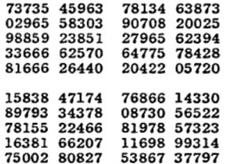
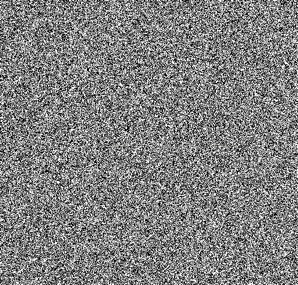
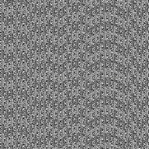
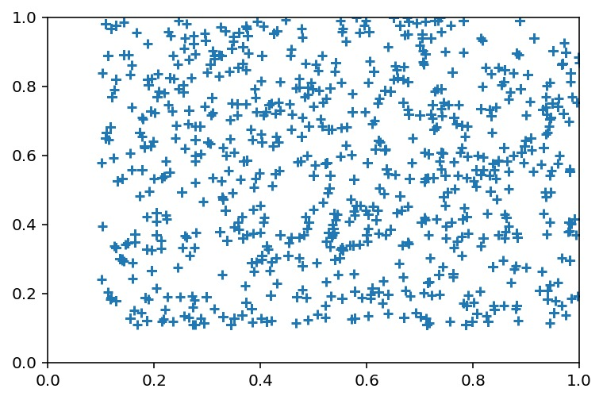
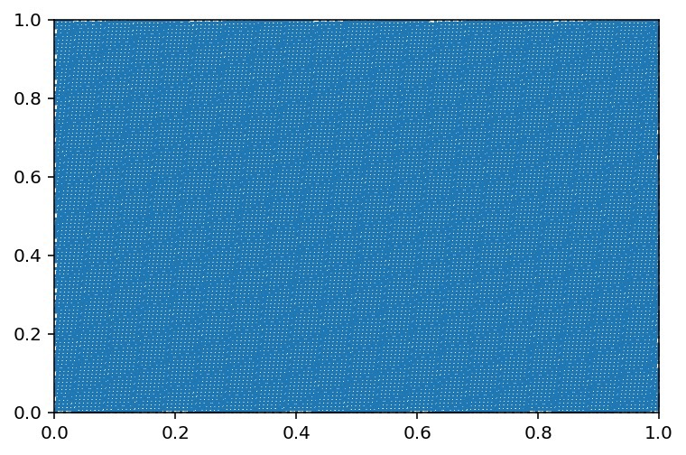
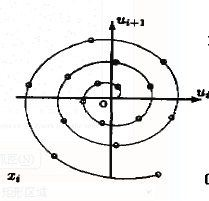

# 随机数的前世今生

“在所有的产生随机数的事物中，我认为没有什么能够超越骰子了”——Francis Galton

-------
!!! note ""
	本文作者：李培函 刘子越 卢浩然

## 一、随机数生成器的发展历史

### 1.长期历史的手动产生随机数

自然界中的随机性随处可见，往往人类不可预知的东西都具有一定的随机性。迄今为止发现最早的骰子是四个面的，它是来自于中东的一座公元前 24 世纪的坟墓里。再近一些的历史是在公元前 1100 年的中国，利用火烧龟壳产生的随机龟裂现象，一些“先知”会根据龟裂情况来对未来做判断。又过了几个世纪，在中国诞生了易经占卜法，利用 49 蓍草法进行占卜，其操作的分裂过程很类似于抛硬币。

随着时间的发展，这种原始的产生随机数的方法已经无法满足人们的需求。现代数学需要大量的随机模拟，而利用骰子等手动方法尽管可以生成真正的随机数，但是这种方法效率低，需要耗费大量的时间，无法做到广泛应用。

### 2.机器产生随机数

时间到了 20 世纪 40 年代中期，RAND 公司（美国兰德公司）发明了一种机器，通过随机脉冲发生器可以生成大量的随机数。他们将这个机器运行所产生的数字聚合起来并发布成图书“A Million Random Digits with 100,000 Normal Deviates”。这个发明在现在的人看起来并不是什么创举，但是在当时却是一个突破。这是人类第一次产生如此大量的、高质量的随机数，并且对公众是开放的。这本书 RAND 公司一直印刷到了 2001 年（现在在亚马逊上也能找到）。

<center></center>

同时还有一种广为人知的随机数生成器，即使在现代社会中我们也会发现它的存在，那就是摇奖机。摇奖机的前身是是由著名的 Bletchley Park WWII 破译小组在 20 世纪 40 年代发明的，当时被用来生成英国保险债券彩票所使用的随机数。在这种机器诞生伊始，人们对于此种方法的随机性提出了很大的质疑。但是官方发布的一个纪录片[The Importance of Being E.R.N.I.E.](https://m.youtube.com/watch?v=rOAfbb5D3Dw)（视频源：YouTube）从科学的角度上介绍了此方法，并逐渐打消了公众的疑虑。

1951 年随机性终于被正式规范化并且整合到了计算机 Ferranti Mark 1 号中。Ferranti Mark 1 号内置了随机数生成指令，利用电气噪声可以一次性生成 20 个随机比特位。这一特性是由阿兰·图灵设计的。Christopher Strachey 利用这一特点，编写了一套随机情书生成器。

但是图灵的随机数指令几乎是当时的开发人员崩溃的，因为这种随机在本身就已经很不稳定的开发环境下又引入了不确定性。人们希望在软件中得到一致性的结果，但是用这种指令的软件永远不可能得到可重复的一致性结果，这也使得软件测试几乎变的不可行。

那么如果随机数生成器可以由一个确定性的函数来替代会怎样呢？如果在给定一个确定的初始条件，每次可以生成同样的随机序列会怎样呢？这就是伪随机数生成器（PRNG）。

### 3.真随机数与伪随机数

说到伪随机数生成器，这里必须要说明一下真随机数与伪随机数的区别，首先对于这些原始的方法，如掷骰子，扔硬币等均是真随机数，根据百度百科中的定义，“真正的随机数是使用物理现象产生的：比如掷钱币、骰子、转轮、使用电子元件的噪音、核裂变等等，这样的随机数发生器叫做物理性随机数发生器，它们的缺点是技术要求比较高”。有的哲学家宣称“世界上不存在真正的随机”，至于世界上是否有真正的随机确实是一个耐人寻味的问题，但是为了现实应用以及统计学的需要，我们需要暂时忽略这种哲学范畴的问题。

因此对于此类物理随机数发生器，我们可以称其为真正的随机数，保证了绝对的公平。而我们也可以看出真随机数具有如下三个性质：随机性（不存在统计学偏差，是完全杂乱的数列）不可预测性（不能从过去的数预测下面的数）；不可重现性（除非将数列本身保存下来，否则不可能出现相同的数列）

<center></center>

与之相对的则是伪随机数，准确的说，所有计算机生成的随机数都会遵循某种规律，都不是真正的随机数。根据百度百科，“真正意义上的随机数（或者随机事件）在某次产生过程中是按照实验过程中表现的分布概率随机产生的，其结果是不可预测的，是不可见的。而计算机中的随机函数是按照一定算法模拟产生的，其结果是确定的，是可见的。我们可以这样认为这个可预见的结果其出现的概率是100%。所以用计算机随机函数所产生的“随机数”并不随机，是伪随机数”。

由于伪随机数是由机器生成的，并非自然界的物理过程，尽管其周期很长，但是理论上仍然是有规律，可预测的。有“好事者”分别利用某种方法分别生成了大量的真随机数和伪随机数，并将这些随机数可视化，如下图：

<center></center>

<center></center>

上面二图分别为真随机数和伪随机数，从直观上看，真随机数没有任何规律而伪随机数确实以一定的规律排列

### 4.伪随机数生成器（PRNG）的出现

首个伪随机数生成器是由冯诺依曼在 1946 年创造的。他的基本思想是从一个随机数种子开始，对其平方，然后取中间值。接下来重复对得到的数取平方并取中间值的过程，就会得到一个具有统计意义属性的随机数序列了。这也就是广为人知的平方取中法。（此部分的各种方法在后面随机数的生成中均会详细说明，在这部分仅仅一笔带过)

然而，冯诺依曼的方法不久后便被后人推翻了，因为不论从什么随机种子开始，序列最终都会落入某个短循环序列，比如：8100,6100,4100，……

序列中的数字是依赖于前一个数字的这种生成函数，上面的重复循环问题是不可避免的。尽管任何伪随机数的生成都是有某种循环的，但是冯诺依曼的平方取中法的这种循环并不够长，因此这种方法很快被改进和取代。1949 年，数学家 D.H.Lehmer 利用线性同余生成器（LCG）实现了这一思路。下面给出的是基于 Lehmer 的方法所实现的一种朴素 PRNG，叫做中央随机数生成器，使用 JavaScript 在 1995 年写的。

线性同余生成器在20世纪的确风靡了很长一段时间，但是随着互联网的迅速发展，人们对于PRNG提出了更高的要求。在此之前的随机数生成器很大程度上依赖于种子，而上世纪90年代中期的 CPU 是没有内置随机数生成指令，持续生成好的种子是非常难得的一件事情，因此网络入侵者们常常通过猜测种子来达成目的。因此在上世纪90年代中期，全球进入了一个随机数生成器狂热的创新时期，各种随机数生成器层出不穷。其中比较出名的便是来自 SGI 的一个团队发明的Lavaland，它是用一个网络摄像头来对着熔岩灯拍照。从摄像头中过来的图片数据是一个真实的熵源，即一个真实的随机数发生器，并且可以以 165kb/s 的速率生成随机数。

同时，还有一个叫做梅森旋转随机数生成器（The Mersenne Twister）的软件 在众多PRNG 中脱颖而出，它是由松本真和西村拓士在 1997 年发明的。它完美地平衡了性能和随机数的质量，并且直到今天仍然不失为一个好的方法。其基本思想是基于线性反馈位移寄存器，能够产生一个循环周期非常长的确定性序列，循环周期能够达到 $2^{19937}-1$。

时间到达21世纪，密码安全正在受到越来越多的重视，与之并行的“密码安全PRNG”也在迅速发展。各种伪随机数生成器的速度不断加快，循环周期也不断加大。尽管很多伪随机数生成器一直受到质疑，但是到目前为止，人们根本无法摆脱对于这些高效的伪随机数生成器的依赖。

## 二、伪随机数生成器

### 1. 种子

正如数列需要有首项，产生伪随机数需要一个初值用来计算整个序列，这个初值被称为“种子”。种子可以是一个固定的值，也可以是根据当前系统状态确定的值。C语言用来产生伪随机数的库函数rand()的种子是固定的值，因此每次调用该函数产生的随机数数列都是相同的。所以为了获得随机性更好的数列，种子应为一个变量，该变量可以与当前系统时间、用户对键盘或鼠标操作情况有关。这里将根据系统时间获得种子。

```js
#include <time.h>
unsigned long ssecond,nowtime;
unsigned long seed;
long gettime()          //获得当前时间
{
    time_t t;
    time(&t);
    struct tm *local;
    local=localtime(&t);
    local->tm_mon++;
    ssecond=(long)local->tm_sec*100+local->tm_sec+36923;
    nowtime=local->tm_sec + local->tm_min*100 + local->tm_hour*10000 + local->tm_mday*1000000+local->tm_mon*100000000　　　    
    return nowtime;
}
```

在调用伪随机数生成函数之前通过seed=gettime()语句就完成了种子的初始化。

### 2. 平方取中法

平方取中法是由冯·诺依曼在1946年提出的，其基本思想为：将数列中的第 $a_i$ 项（假设其有 m 位）平方，取得到的 2m 位数（若不足 2m 位，在最高位前补0）中间部分的 m 位数字，作为 $a_i$ 的下一项 $a_{i-1}$，由此产生一个伪随机数数列。即：

1.	选择一个m位数 $N_i$ 作为种子
2.	计算 $N^2_i$
3.	若 $N^2_i$ 不足 2m 位，在前补0。在这个数选中间 m 个位的数，即 $10^{\lfloor \frac{m}{2} \rfloor +1}$ 至 $10^{\lfloor \frac{m}{2} \rfloor +m}$ 的数，将结果作为 $N_{i+1}$
4.	例：675248 $\longrightarrow$ 455  **959861**  504

平方取中法计算较快，但在实际应用时会发现该方法容易产生周期性明显的数列，而且在某些情况下计算到一定步骤后始终产生相同的数甚至是零，或者产生的数字位数越来越小直至始终产生零。所以用平方取中法产生伪随机数数列时不能单纯使用公式，应该在计算过程中认为加入更多变化因素，比如根据前一个数的奇偶性进行不同的运算，如果产生的数字位数减少时通过另一种运算使其恢复成m位。

```js
import datetime
import math
import numpy as np
time=datetime.datetime.now()
a=np.arange(100)
a_0=str(time)[-6:]
a_1=str(int(a_0)**2)
for i in range(100):
    while(len(a_1)!=len(a_0)*2):
        a_1='0'+a_1
    a_2=a_1[3:9]
    j=0
    while(a_2[j]=='0'):
        a_2=a_2+'0'
        j=j+1
    a[i]=int(a_2)
    a_0=a_2
    a_1=str(int(a_2)**2)
a=a/a.max()
print(a)

输出结果：
[342798, 510468, 577579, 597501, 744500, 554280, 722630, 221941, 257807, 464449,
 712873, 187914, 311671, 138812, 268771, 237850, 572622, 895954, 733570, 124944,
 611003, 324666, 408011, 472976, 706296, 854039, 382613, 392707, 218787, 867751,
 991798, 663272, 929745, 425765, 275835, 849470, 215992, 652544, 813671, 604960,
 659766, 291174, 782298, 990160, 416825, 743080, 167886, 185708, 487461, 618226,
 203387, 366271, 154445, 853258, 492140, 422017, 983480, 672329, 262840, 690848,
 270959, 418779, 375850, 263222, 285821, 693644, 141998, 163432, 710018, 125560,
 765313, 703987, 597696, 240508, 844098, 501433, 435053, 271112, 501716, 718944,
 880475, 236225, 802250, 605062, 100023, 460000, 211600, 447745, 475585, 181092,
 794312, 931553, 790991, 666762, 571564, 685406, 781384, 560955, 670512, 586342]

转化至[0, 1]:
[0.99967772, 0.13137623, 0.91975584, 0.83850847, 0.87570681, 0.34575669,
 0.1295345,  0.4441161,  0.24982093, 0.14891259, 0.73363177, 0.32618563,
 0.2462496,  0.41585466, 0.43961129, 0.35038274, 0.28633027, 0.32910937,
 0.1221221,  0.61826235, 0.51743887, 0.32758588, 0.14210131, 0.79216713,
 0.83700518, 0.40309387, 0.19822818, 0.504277,   0.15025323, 0.12034907,
 0.19272521, 0.39530565, 0.10501915, 0.81409011, 0.33314441, 0.7466128,
 0.15061389, 0.22775853, 0.832563,   0.13393121, 0.58044268, 0.96038811,
 0.37160964, 0.35661614, 0.60741199, 0.48727811, 0.64103093, 0.61041756,
 0.69219027, 0.70143934, 0.60043705, 0.53775046, 0.32638163, 0.37284723,
 0.20366447, 0.64631063, 0.26613587, 0.39889516, 0.90626361, 0.69863178,
 0.21034744, 0.3541733,  0.90927423, 0.47280894, 0.19219481, 0.19322226,
 0.58519199, 0.52430975, 0.34059014, 0.66065856, 0.64275244, 0.77743327,
 0.17201355, 1.0, 0.76927328, 0.81284646, 0.35093637, 0.67065321,
 0.67983864, 0.83520386, 0.45237107, 0.50308892, 0.98614205, 0.80280129,
 0.4509587,  0.25050994, 0.4901382,  0.37727022, 0.45685164, 0.49439045,
 0.48004958, 0.79172968, 0.15117763, 0.39615833, 0.77301433, 0.4622849,
 0.38612831, 0.78401421, 0.22609966, 0.50601063]
```
现生成一万个点并作图，所得图像如下：

<center></center>

显然，这些点在某些位置有聚集，同时0附近没有点分布，并且理论上一万个点足以覆盖整个区域，但仍然留有大片空白，所以平方取中法生成的随机数不够好。并且，当增大点的数量至十万个时，效果不升反降，留白区域更大。如图：

<center></center>

### 3. 线性同余发生器（LCG）

线性同余发生器靠不断进行求余运算迭代生成随机数，其具体公式为

$$ x_n=(ax_{n-1}+c)\ (mod \, M)   \quad n=1,2... $$

这里等式右边的 $(ax_{n-1}+c)\ (mod \, M)$ 表示 $(ax_{n-1}+c)$ 除以 $M$ 的余数，正整数 $M$ 为除数，正整数 $a$ 为乘数，非负整数 $c$ 为增量，取某个非负整数 $x_0$ 为初值可以向前递推，递推只需要序列中前一项，得到的序列 $\{x_n\}$ 为非负整数，$0 \leq x_n < M$。最后，令 $R_n = x_n / M$，则 $R_n \in [0,1)$，把 $\{R_n\}$     作为均匀分布随机数序列。这样的算法的基本思想是因为很大的整数前面的位数是重要的有效位数而后面若干位有一定随机性。如果取 $c = 0$，线性同余发生器称为乘同余发生器, 如果取 $c > 0$，线性同余发生器称为混合同余发生器。

因为线性同余法的递推算法仅依赖于前一项，序列元素取值只有 $M$ 个可能取值，所以产生的序列 $x_0, \, x_1, \, x_2, \,...$ 一定会重复。若存在正整数 $n$ 和 $m$ 使得 $x_n = x_m (m < n)$，则必有 $x_n+k = x_m+k, \ k = 0,1,2, \, ...$， 即 $x_n, \, x_{n+1}, \, x_{n+2}, \, ...$ 重复了 $x_m, \, x_{m+1}, \, x_{m+2}, \, ...$，称这样的 $n−m$ 的最小值 $T$ 为此随机数发生器在初值 $x_0$ 下的周期。由序列取值的有限性可见 $T \leq M$。

$T \leq M$ 且有的线性同余发生器可以达到最大周期 M，称为满周期。满周期时，初值 $x_0$ 取为 $0 \sim M − 1$ 间的任意数都是一样的，$x_M = x_0$ ，序列从 $x_M$ 开始重复。如果发生器从某个初值不是满周期的，那么它从任何初值出发都不是满周期的，不同初值有可能得到不同序列。比如随机数 $x_n = 7x_{n−1} + 7 \, (mod 10)$， 从不同初值出发的序列可能为如$7,6,9,0,7, \, ...$；$1,4,5,2,1, \, ...$；$3,8,3$。不同的 $M, \, a, \, c$ 选取方法得到不同的周期，适当选取 $M, \, a, \, c$ 才能使得生的随机数序列和真正的 $U[0,1]$ 随机数表现接近。

#### 3.1混合同余发生器

线性同余发生器中 $c > 0$ 时称为混合同余发生器。

        定理：当下列三个条件都满足时，混合同余发生器可以达到满周期
        1. c 与 M 互素;
        2. 对 M 的任一个素因子 P，a − 1 被 P 整除
        3. 如果 4 是 M 的因子，则 a − 1 被 4 整除$$ 

常取 $M = 2L, \, L$ 为计算机中整数的尾数字长。这时根据上述定理，建议取 $a = 4\alpha+1, \ c = 2\beta + 1$，$\  alpha$ 和 $\beta$ 为任意正整数，$x_0$ 为任意非负整数，这样的混合同余发生器是满周期的，周期为 $2L$ 。好的均匀分布随机数发生器应该周期足够长，统计性质符合均匀分布序列之间独立性好。把同余法生成的数列看成随机变量序列 $\{x_n \}$，在满周期时，可认为 $x_n$ 是从 $0 \sim M − 1$中随机等可能选取的，即$P\{x_n = i\} = 1/M, \quad i = 0, \, 1, \, ..., \,M – 1$，这时有，

$$\begin{align} 
EX_n &= \sum_{i=0}^{M-1} i \cdot \frac{1}{M}=\frac{M-1}{2} \\
Var(X_n)&=E(X_n^2)-(EX_n)^2= \sum_{i=0}^{M-1} i^2 \frac{1}{M}- \frac{(M-1)^2}{4}=\frac{1}{12} (M^2-1)
\end{align}
$$

于是当$M$很大时，

$$ER_n=\frac{1}{2}-\frac{1}{2M} \approx \frac{1}{2} \\
Var(R_n)=\frac{1}{12}-\frac{1}{12M^2} \approx \frac{1}{12}$$

可见 M 充分大时从一、二阶矩看生成的数列很接近于均匀分布。

随机数序列还需要有很好的随机性。数列的排列不应该有规律，序列中的两项不应该有相关性。因为序列由确定性公式生成，所以不可能真正独立。至少我们要求是序列自相关性弱。对于满周期的混合同余发生器可以得序列中前后两项自相关系数的近似公式$\rho(1) \approx \frac{1}{a}-\frac{6c}{aM} (1-\frac{c}{M})$， 所以应该选 $a$ 值大（但 $a < M$）。

例：Kobayashi 提出了如下的满周期 2^31 的混合同余发生器，其周期较长，统计性质比较好。

$$x_n=(314159269x_{n-1}+453806245) \ (mod \, 2^{31})$$

以下是混合同余发生器的实现代码，m为256，生成一个满周期的随机数序列。

```js
import datetime
import math
import numpy as np
time=datetime.datetime.now()
a_0=str(time)[-3:]
a_0=int(a_0)
print("alpha=")
alpha=int(input())
print("beta=")
beta=int(input())
print("m=")
m=int(input())
a=4*alpha+1
c=2*beta+1
x=np.arange(256)
for i in range(256):
    a_1=(a*a_0+c)%m
    x[i]=a_1
    a_0=a_1
print(x)

输出结果：
[139, 250, 121,   8, 167,  86,  21, 228, 195, 178, 177, 192, 223, 14,  77, 156, 251, 106, 233, 120, 23, 198, 133,  84,  51,  34, 33,  48,  79, 126, 189, 12, 107, 218, 89, 232, 135, 54, 245, 196, 163, 146, 145, 160, 191, 238,  45, 124, 219,  74, 201,  88, 247, 166, 101,  52,  19,   2,   1,  16,  47,  94, 157, 236,  75, 186,  57, 200, 103,  22, 213, 164, 131, 114, 113, 128, 159, 206, 13,  92, 187,  42, 169,  56, 215, 134,  69,  20, 243, 226, 225, 240,  15,  62, 125, 204,  43, 154,  25, 168,  71, 246, 181, 132, 99,  82,  81,  96, 127, 174, 237,  60, 155,  10, 137,  24, 183, 102,  37, 244, 211, 194, 193, 208, 239,  30,  93, 172,  11, 122, 249, 136,  39, 214, 149, 100,  67,  50,  49,  64,  95, 142, 205, 28, 123, 234, 105, 248, 151,  70,   5, 212, 179, 162, 161, 176, 207, 254,  61, 140, 235,  90, 217, 104,   7, 182, 117,  68,  35, 18,  17,  32,  63, 110, 173, 252,  91, 202,  73, 216, 119,  38, 229, 180, 147, 130, 129, 144, 175, 222,  29, 108, 203,  58, 185, 72, 231, 150,  85,  36,   3, 242, 241,   0,  31,  78, 141, 220, 59, 170,  41, 184,  87,   6, 197, 148, 115,  98,  97, 112, 143, 190, 253,  76, 171,  26, 153,  40, 199, 118,  53,   4, 227, 210, 209, 224, 255,  46, 109, 188,  27, 138,   9, 152,  55, 230, 165, 116,  83,  66,  65,  80, 111, 158, 221,  44]

转化为[0,1]
[0.54509804, 0.98039216, 0.4745098 , 0.03137255, 0.65490196, 0.3372549 , 0.08235294, 0.89411765, 0.76470588, 0.69803922, 0.69411765, 0.75294118, 0.8745098 , 0.05490196, 0.30196078, 0.61176471, 0.98431373, 0.41568627, 0.91372549, 0.47058824, 0.09019608, 0.77647059, 0.52156863, 0.32941176, 0.2, 0.13333333, 0.12941176, 0.18823529, 0.30980392, 0.49411765, 0.74117647, 0.04705882, 0.41960784, 0.85490196, 0.34901961, 0.90980392, 0.52941176, 0.21176471, 0.96078431, 0.76862745, 0.63921569, 0.57254902, 0.56862745, 0.62745098, 0.74901961, 0.93333333, 0.17647059, 0.48627451, 0.85882353, 0.29019608, 0.78823529, 0.34509804, 0.96862745, 0.65098039, 0.39607843, 0.20392157, 0.0745098 , 0.00784314, 0.00392157, 0.0627451 , 0.18431373, 0.36862745, 0.61568627, 0.9254902 , 0.29411765, 0.72941176, 0.22352941, 0.78431373, 0.40392157, 0.08627451, 0.83529412, 0.64313725, 0.51372549, 0.44705882, 0.44313725, 0.50196078, 0.62352941, 0.80784314, 0.05098039, 0.36078431, 0.73333333, 0.16470588, 0.6627451 , 0.21960784, 0.84313725, 0.5254902 , 0.27058824, 0.07843137, 0.95294118, 0.88627451, 0.88235294, 0.94117647, 0.05882353, 0.24313725, 0.49019608, 0.8, 0.16862745, 0.60392157, 0.09803922, 0.65882353, 0.27843137, 0.96470588, 0.70980392, 0.51764706, 0.38823529,
0.32156863, 0.31764706, 0.37647059, 0.49803922, 0.68235294, 0.92941176, 0.23529412, 0.60784314, 0.03921569, 0.5372549 , 0.09411765, 0.71764706, 0.4, 0.14509804, 0.95686275, 0.82745098, 0.76078431, 0.75686275, 0.81568627, 0.9372549 , 0.11764706, 0.36470588, 0.6745098 , 0.04313725, 0.47843137, 0.97647059, 0.53333333, 0.15294118, 0.83921569, 0.58431373, 0.39215686, 0.2627451 , 0.19607843, 0.19215686, 0.25098039,
0.37254902, 0.55686275, 0.80392157, 0.10980392, 0.48235294, 0.91764706, 0.41176471, 0.97254902, 0.59215686, 0.2745098 , 0.01960784, 0.83137255, 0.70196078, 0.63529412, 0.63137255, 0.69019608, 0.81176471, 0.99607843, 0.23921569, 0.54901961, 0.92156863, 0.35294118, 0.85098039, 0.40784314, 0.02745098, 0.71372549, 0.45882353, 0.26666667, 0.1372549 , 0.07058824, 0.06666667, 0.1254902 , 0.24705882, 0.43137255, 0.67843137,
0.98823529, 0.35686275, 0.79215686, 0.28627451, 0.84705882, 0.46666667, 0.14901961, 0.89803922, 0.70588235, 0.57647059, 0.50980392, 0.50588235, 0.56470588, 0.68627451, 0.87058824, 0.11372549, 0.42352941, 0.79607843, 0.22745098, 0.7254902 , 0.28235294, 0.90588235, 0.58823529, 0.33333333, 0.14117647, 0.01176471, 0.94901961, 0.94509804, 0.  , 0.12156863, 0.30588235, 0.55294118, 0.8627451 , 0.23137255, 0.66666667, 0.16078431, 0.72156863, 0.34117647, 0.02352941, 0.77254902, 0.58039216, 0.45098039, 0.38431373, 0.38039216, 0.43921569, 0.56078431, 0.74509804, 0.99215686, 0.29803922, 0.67058824, 0.10196078, 0.6, 0.15686275, 0.78039216, 0.4627451 , 0.20784314, 0.01568627, 0.89019608, 0.82352941, 0.81960784, 0.87843137, 1.        , 0.18039216, 0.42745098, 0.7372549 , 0.10588235, 0.54117647, 0.03529412, 0.59607843, 0.21568627,
0.90196078, 0.64705882, 0.45490196, 0.3254902 , 0.25882353, 0.25490196, 0.31372549, 0.43529412, 0.61960784, 0.86666667, 0.17254902]
```
如下是m=8192且满周期时，8192组点的分布图像：

<center></center>

可以看出这次的点的分布相比平方取中均匀很多，但仍然明显表现出某种分布模式。

#### 3.2乘同余法

线性同余发生器中 $c = 0$ 时的生成方法称为乘同余法，或称积式发生器。这时的递推公式为，

$$ x_n=ax_{n-1}\ (mod \, M)   \quad n=1,2... $$

问题是如何选 $M, \,a$ 达到大周期且统计性质好。显然各 $x_n$ 都不能等于 0；如果某个 $x_k = 0$， 则$x_{k+1} = x_{k+2} = ... = 0$。乘同余法有可能进入 0 就不再周期变化，称为退化情况，这时周期为1。所以乘同余法能够达到的最大周期是 $M − 1$，每个 $x_n$ 都只在 $\{1, \,2 \, ,..., \, M − 1\}$ 中取值。

由于证明过程略复杂，这里直接给出结论：对乘同余法，当 $M$ 与 $a$ 互素且 $M$ 与 $x_0$ 互素时，

$$x_n=a^nx_0 \ (mod \, M)$$ 

易见 $x_n$ 与 $M$ 互素，序列不会退化为0。

#### 3.3素数模乘同余法

若取 $M$ 为小于 $2^L$ 的最大素数，选取适当的 $a$ 可以达到 $T = M − 1$ 周期，这样的发生器叫素数模乘同余发生器。
    
    定义（素元）： 设正整数 a 和素数 M 互素，若 a 对模 M 的阶数 V 满足 V = M − 1，则称 a 为 M 的素元 (或原根)。

乘同余发生器中取 a 为 M 的素元可以达到最大周期 M − 1。

例 M = 7 是素数，取 a = 3 与 M 互素。考虑素数模乘同余发生器，

$$x_n=a^n \ (mod \, M) \quad n=1, \, 2, \, ... \  x_0=1$$ 

序列为 $1, \, 3, \, 2, \, 6, \, 4, \, 5, \, 1, \, 3, \, ...$。周期达到 $M − 1 = 6$，所以 $a = 3$ 是 $M = 7$ 的素元。可以验证 $a = 5$ 也是 $M = 7$ 的素元，序列为 $1, \, 5, \, 4, \, 6, \, 2, \, 3, \, 1, \, 5, \, ...$。$1, \, 2, \, 4, \, 6$ 不是 $M = 7$的素元。此例说明素元可以不唯一。

在选取素数模乘同余发生器的参数 $M$ 和 $a$ 的时候，可以取 $M$ 为小于 $2L$ 的最大素数 ($L$为计算机整数表示的尾数位数)，取 $a$ 为 $M$ 的素元，这样保证周期 $T = M − 1$。$a$ 应尽可能大，$a$ 的二进制表示尽可能无规律。这样在一个周期内可以得到 $1, \, 2, \, ..., \, M − 1$ 的一个排列。初值 $x_0$ 可以取 $1, \, 2, \, ..., \, M − 1$ 中任一个。

### 4. FSR 发生器

线性同余法的周期不可能超过 $2^L$ ($L$ 为整数型尾数的位数)，而且作为多维随机数相关性大，分布不均匀。基于 Tausworthe(1965) 文章的 FSR 方法是一种全新的做法，对这些方面有改善。

FSR(反馈位移寄存器法) 按照某种递推法则生成一系列二进制数 $\alpha_1, \, \alpha_2, \, ..., \, \alpha_k, \,...,$ 其中 $\alpha_k$ 由前面的若干个 $\{\alpha_i\}$ 线性组合并求除以 2 的余数产生:

$$\alpha_k=(c_p \alpha_{k-p}+c_{p-1} \alpha_{k-p+1} +...+ c_1 \alpha_{k-1}) \ (mod \, 2) \quad k=1, \, 2, \, ...$$ 

线性组合系数 $\{c_i\}$ 只取 $0, \, 1,$ 这样的递推可以利用程序语言中的整数二进制运算快速实现。给定初值 $(\alpha_{p+1}, \alpha_{p+2}, \, ..., \, \alpha_0)$ 向前递推，得到 $\{\alpha_k, \  k = 1, \, 2, \, ...\}$ 序列后依次截取长度为 $L$ 的二进制位组合成整数 $x_n$，$R_n = x_n/2L$。不同的组合系数和初值选择可以得到不同的随机数发生器, 巧妙设计可以得到很长的周期，作为多维均匀随机数性质较好。

### 5. 组合发生器法

随机数设计中比较困难的是独立性和多维的分布。可以考虑把两个或若干个发生器组合利用, 可以比单个发生器由更长的周期和更好的随机性。

例 Wichman 和 Hill(1982) 设计了如下的线性组合发生器，利用三个 16 位运算的素数模乘同余发生器:

$$U_n=171U_{n-1} \ (mod \, 30269) \\
V_n=172V_{n-1} \ (mod \, 30307)\\
W_n=170W_{n-1} \ (mod \, 30323)$$ 作线性组合并求余：
$$R_n=(U_n/30269+V_n/30307+W_n/30323) \ (mod \, 1)$$ 

这个组合发生器的周期约有 $7 × 10^{12}$ 长, 超过 $2^{32} \approx 4 × 10^9$。

例：MacLaren 和 Marsaglia(1965) 设计了组合同余法，组合两个同余发生器，一个用来“搅乱”次序。

设有两个同余发生器 A 和 B。用 A 产生 $m$ 个随机数 (如 $m = 128$)，存放在数组$T = (t_1, \, t_2, \, ..., \,t_m)$。 需要产生 $x_n$ 时，从 B 中生成一个随机下标 $j \in \{1, \, 2, \, ..., \, m\}$，取 $x_n = t_j$ ，但从 A 再生成一个新随机数 $y$ 代替 $T$ 中的 $t_j$，如此重复。这样组合可以增强随机性，加大周期 (可超过 $2L$ )。也可以只使用一个发生器，用 $x_{n−1}$ 来选择下标。

组合发生器的代码与普通同余发生器的代码类似：

```js
import datetime
import math
import numpy as np
time=datetime.datetime.now()
a_0=str(time)[-3:]
a_0=int(a_0)
print("alpha=")
alpha=int(input())
print("beta=")
beta=int(input())
print("m=")
m=int(input())
a=4*alpha+1
c=2*beta+1
x=np.arange(256)
for i in range(256):
    a_1=(a*a_0+c)%m
    x[i]=a_1
    a_0=a_1
b_0=str(time)[-6:-3]
b_0=int(b_0)
y=np.arange(256)
for i in range(256):
    b_1=(a*b_0+c)%m
    y[i]=x[b_1]
    x[b_1]=(a*a_0)%m
    b_0=b_1
    a_0=x[b_1]
print(y)
```

在 R 软件中，用 runif(n) 产生 n 个 $U(0,1)$ 均匀分布的随机数。R 软件提供了若干种随机数发生器，可以用 RNGkind函数切换。在使用随机数进行随机模拟研究时，如果希望模拟研究的结果可重复，就需要在模拟开始时设置固定的随机数种子。虽然不同的随机数发生器种子的形式有所不同，在 R 中，总是可以用函数 set.seed(seed) 来设置种子，其中 seed 是一个序号，实际的种子由这个序号决定。

### 6. 梅森旋转演算法

最后，我们再介绍一种当今效果较好，使用较广的伪随机数算法，梅森旋转演算法（Mersenne twister）。由于机理较为复杂，所以主要给出给出在python中的实现，对于具体原理只做概述。

梅森旋转演算法由松本真和西村拓士在1997年开发，基于有限二进制字段上的矩阵线性递归。可以快速产生高质量的伪随机数，修正了古典随机数发生算法的很多缺陷。Mersenne Twister这个名字来自周期长度取自梅森素数的这样一个事实。这个算法通常使用两个相近的变体，不同之处在于使用了不同的梅森素数。一个更新的和更常用的是MT19937, 32位字长。还有一个变种是64位版的MT19937-64。对于一个k位的长度，Mersenne Twister会在[0,2^k -1]的区间之间生成离散型均匀分布的随机数。

梅森旋转算法是R、Python、Ruby、IDL、Free Pascal、PHP、Maple、Matlab、GNU多重精度运算库和GSL的默认伪随机数产生器。从C++11开始，C++也可以使用这种算法。

梅森旋转算法具有明显的优势。首先，其周期非常长，达到$2^{19937}−1$。尽管如此长的周期并不必然意味着高质量的伪随机数，但短周期确实会带来许多问题。且其在1 ≤ k ≤ 623的维度之间都可以均等分布。除了在统计学意义上的不正确的随机数生成器以外，在所有伪随机数生成器法中是最快的（当时）。

整个算法主要分为三个阶段：第一阶段获得基础的梅森旋转链；第二阶段对于旋转链进行旋转算法；第三阶段对于旋转算法所得的结果进行处理。算法实现的过程中，参数的选取取决于梅森素数，故此得名。

下面的一段代码使用MT19937算法生成范围在$[0, 2^{32} − 1]$的均匀分布的32位整数：

```js
def _int32(x):
    return int(0xFFFFFFFF & x)

class MT19937:
    def __init__(self, seed):
        self.mt = [0] * 624
        self.mt[0] = seed
        for i in range(1, 624):
            self.mt[i] = _int32(1812433253 * (self.mt[i - 1] ^ self.mt[i - 1] >> 30) + i)


    def extract_number(self):
        self.twist()
        y = self.mt[0]
        y = y ^ y >> 11
        y = y ^ y << 7 & 2636928640
        y = y ^ y << 15 & 4022730752
        y = y ^ y >> 18
        return _int32(y)


    def twist(self):
        for i in range(0, 624):
            y = _int32((self.mt[i] & 0x80000000) + (self.mt[(i + 1) % 624] & 0x7fffffff))
            self.mt[i] = y ^ self.mt[(i + 397) % 624] >> 1

            if y % 2 != 0:
                self.mt[i] = self.mt[i] ^ 0x9908b0df
```
调用函数 MT19937(seed).extract_number() 将会返回随机数，其中 seed 是已确定的种子。

## 三、随机数的检验

### 1. 随机数检验的必要性

将随机数生成器应用在并行进程中尤其要注意的是随机数之间是否关联，即独立性检测。首先，我们先看一个随机数检验的一个例子，以此说明对于伪随机数来说检验的必要性。用线性同余算法得到的均匀分布经Box-Muller转换成正态分布得到的点落在一条螺旋线上。

从理论上可以证明所有的线性和非线性同余序列都存在长周期相关现象。如果几个并行处理器分别使用同一个同余序列的不同段落，分割时就应该避开具有强相关的分点。由下图可见，我们平常用到最多的线性同余算法产生的随机数是如此的“不随机”，所以，在某些情况下，简单的线性同余序列肯定是不适用的，应当使用具有更大周期的生成序列，尽管实际上只要生这个周期中的很小的一部分。

<center></center>

另一个例子是，一个经典的称为 RANDU 的随机数发生器用在一维积分时效果很好，但连续三个一组作为三维均匀分布则很不均匀。所以当我们利用机器生成了一组随机数样本后，为了验证随机数产生的效果，我们往往还需要对于生成的随机数进行检验。同时，对于不同的问题生成的随机数的好坏也是不同的。下面我们将介绍一些常用的随机数检验方法。

### 2. 随机数检验方法

对于生成的随机数样本的检验，我们可以很自然的联系到数理统计这门学科中的各种假设检验方法，如显著性检验、似然比检验、一致最大功效检验等。泛泛而言，这些方法对于生成随机数的样本检验均是可行的。但同时，针对随机数的检验还有很多不一样的方法和地方，为了简单起见，我们仅列举对于均匀分布随机数发生器产生的序列 $\{R_n, \ n = 1, \, 2, \, ..., \, N\}$ 的均匀性与独立性进行检验的一些方法：

1.	对随机数列 $\{R_n, \ n = 1, \, 2, \, ..., \, N\}$ 计算

	$$\bar{R}=\frac{1}{N} \sum_{n=1}^{N} R_n, \ \ \bar{R^2}=\frac{1}{N} \sum_{n=1}^{N}R_n^2, \ \ S^2=\frac{1}{N} \sum_{n=1}^{N}(R_n-\frac{1}{2})^2$$

	假设我们产生的随机数的样本足够多，则 $N \longrightarrow \infty$ 时这三个统计量均渐近服从正态分布，可以用Z检验法检验这三个统计量与理论期望值的偏离程度。

2.	把 $[0, 1]$ 等分成 k 段，用拟合优度卡方检验法检验 $\{R_n, \ n = 1, \, 2, \, ..., \, N\}$ 落在每一段的取值概率是否近似为 $1/k$。
3.	用 Kolmogorov-Smirnov检验法进行拟合优度检验，看$\{R_n, \ n = 1, \, 2, \, ..., \, N\}$ 是否与$U[0,1]$ 分布相符。
4.	把 $\{R_n, \ n = 1, \, 2, \, ..., \, N\}$每 $d$ 个组合在一起成为 $R^d$ 向量，把超立方体 ${[0, 1]}^d$ 每一维均分为 $k$ 份，得到 $k^d$ 个子集，用卡方检验法检验组合得到的 $R^d$ 向量落在每个子集的概率是否近似为 $k^{−d}$。
5.	把 $\{R_n, \ n = 1, \, 2, \, ..., \, N\}$ 看作时间序列样本，计算其样本自相关函数列 $\{\rho_j, \ j = 1, \, 2, \, ..., \, N\}$，在 $\{R_n, \ n = 1, \, 2, \, ..., \, N\}$独立同分布情况下 $\{\sqrt{N} \rho_j, \ j = 1, \, 2, \, ..., \, N\}$ 应该渐近服从独立的标准正态分布。
6.	把$\{R_n\}$ 离散化为 $y_n = floor(kR_n), \ n = 1, \, 2, \, ..., \, N,$ 令 $\xi_n = y_n, \, \eta_n = y_n+b$（$b$ 为正整数），$n = 1, \, 2, \, ..., \, N − b,$ 用列联表检验法检验 $\xi_n$ 和 $\eta_n$ 的独立性。
7.	扑克检验。把 $\{R_n\}$ 离散化为 $y_n = floor(8R_n), \, n = 1, \, 2, \, ..., \, N,$ 然后每连续的 8 个作为一组，计数每组内不同数字的个数（1 ∼ 8 个）。在 $\{R_n\}$ 独立同均匀分布条件下每组内不同数字个数的理论分布概率可以计算出来，然后用卡方检验法检验实际观测与理论概率是否相符。
8.	配套检验。$\{R_n\}$ 离散化为 $y_n = floor(kR_n)$ （k 为正整数），$n = 1, \, 2, \, ..., \, N,$ 然后顺序抽取$\{y_n, \ n = 1, \, 2, \, ..., \, N\}$ 直到 $\{y_n\}$ 的可能取值 $\{0, \, 1, \, ..., \, k − 1\}$ 都出现过为止，记录需要抽取的 $\{y_n\}$ 的个数 $L$，反复抽取并记录配齐数字需要抽取的值的个数 $l_j , j = 1, \, 2, \, ...$ 。在 $\{R_n\}$ 独立同 $U(0,1)$ 分布条件下这样的 $L$ 分布可以得到，可以计算 $\{l_j\}$ 的平均值并用渐近正态分布检验观测均值与理论均值的差异大小，或直接用卡方检验法比较 $\{l_j\}$的样本频数与理论期望值。
9.	正负连检验。令 $y_n = R_n − 1/2$，把连续的 $\{y_n\}$ 的正值分为一段，把连续的 $\{y_n\}$ 的负值分为一段，每段叫做一个“连”，连长 $L$ 的分布概率为 $P(L = k) = 2^{−k}, \ k = 1, \, 2, \, ...$，可以用卡方检验法检验 $L$ 的分布；总连数 $T$ 满足
	
	$$ET = (n+1)/2 \quad Var(T) = (n−1)/4$$
	
	也可以用 Z 检验法检验 T 的值与理论期望的差距。

10.	升降连检验。计算 $y_n = R_n − R_{n−1}, \ n = 2, \, 3, \, ..., \, N$，把连续的正值的 $\{y_n\}$ 分为一段叫做一个上升连，把连续的负值的 $\{y_n\}$ 分为一段叫做一个下降连，可以用卡方检验法比较连的长度与 $\{R_n\}$ 独立同分布假设下的理论分布，或用 Z 检验法比较总连数与理论期望值的差距。

## 四、随机数的应用

### 1.随机模拟

随机模拟就是基于随机数的方法，非常经典的一个例子就是蒲丰投针。模拟是指把某一现实的或抽象的系统的某种特征或部分状态，用另一系统来代替或模拟。为了解决某问题，把它变成一个概率模型的求解问题，然后产生符合模型的大量随机数，对产生的随机数进行分析从而求解问题，这种方法叫做随机模拟方法，又称为蒙特卡洛 (Monte Carlo) 方法。利用这种方法可以进行面积估算，积分计算等，此方法已在课堂上详细讲述过了，在此不再进行赘述。

### 2.利用随机数可以获得各种比例的策略

随机数在博弈论方面也有着很大的应用。利用随机数可以获得各种比例的混合策略。

“秒针可以让你获得任何比例的混合策略”——《策略思维（Thinking Strategically）》，在这本书中对于博弈策略的阐述中，说明了为了达到让本方利益最大化需要以一定的比例使用混合策略。例如一个网球选手，他在发球时可以选择发外旋球也可以选择发内旋球，但是他发外旋球和内旋球的水平是不同的，假如他发外旋球对手无法接到的概率是60%，而发内旋球对手无法接到的概率是40%，刚开始显然发外旋球会让对手更吃不消，故应该每次发球都选择发外旋球。当发了一定数量得球后，对手对于他的外旋球必然有所防备，如果仍然持续发外旋球，发球得分率会极大的降低。当发了足够多的球，根据博弈论中的纳什均衡理论，这个人最后应该以60%的概率发外旋球并且以40%的概率发内旋球，为了保证这个概率是绝对随机的并且不受人主观情绪的影响，书中提出了利用秒针来构造随机数，当秒针指向0到39时，选择发外旋球，当秒针指向40到59时选择发内旋球，当然最重要的一点是不要让对手发现你用这种方法制造随机数，这样自己的发球才能给对手造成最大的困扰。

### 3.随机数在信息安全中的应用

随机数一个非常重要的应用则是在网络安全上。可以说正是因为网络安全的需求，才从一定程度上推进了各种伪随机数生成器的出现。

安全可靠的通信除了需要进行消息验证，还需要建立一些规范的协议对数据来源的可靠性、通信实体的真实性加以认证，以防止欺骗、伪装等攻击，这时通信双方就需要建立共享密钥，同时共享密钥必须具备保密性和实时性。为了防止会话密钥的伪造或泄露，会话密钥在通信双方之间交换时应以密文形式，所以通信双方实现就应有密钥或公开钥。实时性则对防止消息的重放攻击极为重要，实现实时性的一种方法是对交换的每一条消息都加上一个序列号，一个消息仅当它有正确的序列号时才被接收。为了保证消息的实时性，常用“询问-应答”的方法，即用户A向B发出一个一次性的随机数作为询问，如果收到B发来的消息也包含一个正确的一次性随机数，A就认为B发来的消息是新的并接受，因此为保证通信双方的实时性，随机数是一种重要的手段。

除此之外随机数在密码学中也有着重要的应用。在密码学里有个基本原则：密码系统的安全性应该依赖于密钥的复杂性，而不是算法的保密性。因此对于一个固定的算法，只有每一次生成随机数，才能增加攻击者的难度。许多网络密钥都需要依赖于伪随机数生成器。
事实上，随机数不论是在生活中还是在科学上都有着很多的应用。以上列举的几个应用仅仅是随机数的几个最重要的应用。随机数能够让我们的生活更加有趣多变，但同时也在保护着我们的信息安全免受黑客袭击。正是因为世界上的太多事情都是随机的，我们往往会意识不到这种随机数生成对于我们生活的重要意义，而事实上，我们的生活始终与各种随机数的生成紧密相连。

## 五、结尾

从以上的文章可以看出现在的伪随机数发生器种类繁多效率很高，但是在有些特殊情况，伪随机数并不能满足人们全部的需求，这时候就需要真随机数生成器。而 我国对于真随机数发生器的研究主要集中在量子随机数发生器领域。近年来，由于人们对信息安全的重视度的提高，再加上量子保密通信、量子计算等量子信息技术的发展，量子随机数发生器的研究也取得了巨大的进步，量子随机数的产生速率不断提高，量子随机变量从离散变量发展到连续变量，量子噪声的带宽也逐渐变宽。


真随机数发生器行业得到了政策的大力支持，从产品应用来看，发展前景较好，从而吸引了较多的投资者关注，但该行业具有较高的技术壁垒，且技术研发周期长，资金投入规模大，不具备一定的技术基础、研发实力及资金实力，很难获得长期发展。同时由于供应商较少，现有企业的真随机数发生器产品价格高昂，真随机数发生器的实际应用还非常有限。因此，目前国内真随机数发生器行业呈现投资热而市场冷的现象。

因此在当今社会，除了提升伪随机数生成器的循环周期以及效率，能够发明良好的真随机数生成器或许已成为重大需求。而由真随机数的定义，仅仅从算法上的改进无法发明真随机数生成器，根本则是要利用自然中的物理现象，这就需要统计学研究者与物理研究者的跨领域合作。随着社会对于安全性保密性的逐渐重视，真随机数生成器或许会成为统计学家们一个重要的跨领域合作的研究方向。


