## 第一章：导论
### 1.1统计学习概述
统计学习是一套以理解数据为目的的庞大的工具集,统计学习的工具可分为两大类:有指导的学习和无指导的学习。
(1)有指导的统计学习工具主要有两种用途：
>面向预测的统计模型的建立。
对一个或多个给定的输入估计某个输出。

(2)无指导的统计学习问题的特征：
>有输入变量但不指定输出变量。
建模的主旨是学习数据的关系和结构。

### 1.2统计学习简史：
(1)回归问题（输入输出为定量变量，用于预测）

<center></center>

(2)分类问题（输入定量变量，输出定性变量）

<center></center>


(3)聚类问题（有输入，无输出）


### 1.3实例分析
**(1)工资数据——回归问题，用于预测，输入输出均为定量变量**

<center>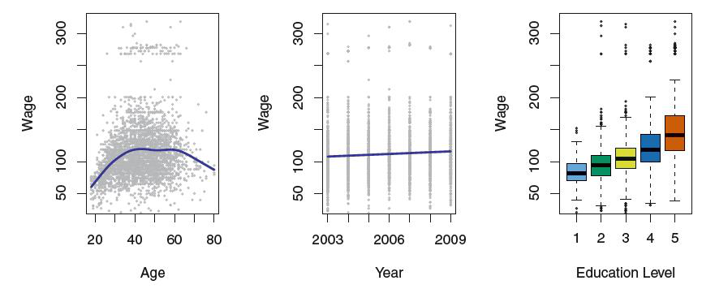
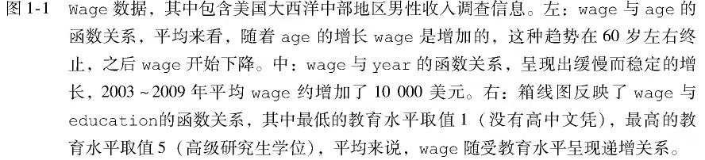</center>

**(2)金融市场数据——分类问题，输出为定性变量**
<center>
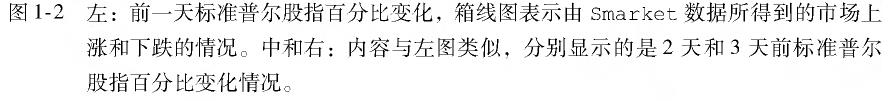
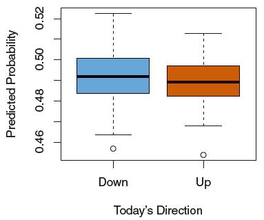
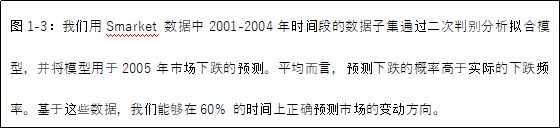</center>

**(3)基因表达数据——聚类问题，有输入无输出**

<center>
 </center>


## 第二章：统计学习
### 2.1什么是统计学习
输入变量X又称为预测变量、自变量、属性变量,甚至有时候就称为变量,输出变量Y又称为晌应变量或因变量.假设观察到一个定量的响应变量Y 和p个不同的预测变量,记为$X_1,...,X_p$。假设Y和$X=(X_1,...,X_p)$有一定的关系,可以表达成一个比较一般的形式: $Y =f(X) +ε$。这里的$f$是$X_1,...,X_p$的函数,它是固定的但未知,$ε$是随机误差项,与X独立,且均值为0。在这种形式下,f表达了X 提供给Y 的系统信息。**统计学习是关于估计f 的一系列方法。**

<center>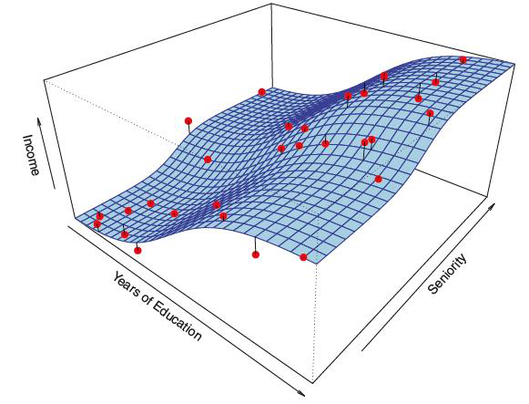
</center>

#### 2.1.1 什么情况下需要估计f
估计f 的主要原因有两个:预测和推断


**(1)预测**


$$\hat{Y}=\hat{f}(x)$$


其中$\hat{f}$ 表示f的预测，$\hat{Y}$ 表示Y的预测值。在这个式子中$\hat{f}$是黑箱,不需了解$X,Y$之间具体形式，只要能使模型准确预测$\hat{Y}$。作为响应变量$Y$的预测，其精确性依赖于两个量，一个是可约误差(针对模型)，另一个是不可约误差。


$$E(Y-\hat{Y})^2=E[f(X)+\varepsilon-\hat{f}(X)]^2=\underbrace{[f(X)-\hat{f}(X)]^2}_{可约误差}+\underbrace{Var(\varepsilon)}_{不可约误差}$$


**(2)推断**


估计f的目标不是为了预测Y,而是想明白X和Y的关系。更确切地，是去理解Y作为$X_1,...,X_p$的函数是怎么变化的。这种情况下，$\hat{f}$不能当作黑箱看待，因为我们需要知道它的具体形式。


#### 2.1.2 如何估计f


假设己观测到一组n 个不同的点，这些观测点称做训练数据。令$X_{ij}$表示观测点i的第j个预测变量或输入变量值，其中i = 1 , 2,… , n 和j = 1 , 2 ,… , p 。相应地，令$Y_i$表示第i 观测点的响应变量值。一般而言，这项估计任务的大多数统计学习方法都可分为两类:参数方法和非参数方法。


**(1)参数方法**


基于模型的方法统称为参数法，参数法把估计f 的问题简化到估计一组参数。对f 假设一个具体的参数形式将简化对f 的估计，因为估计参数是更为容易的。参数方法的缺陷是选定的模型并非与真正的f在形式上是一致的。

假如我们选择的模型与真实的f 差距太大，这样估计的f效果也会很差。此类问题的一种解决思路是尝试通过选择光滑模型拟合很多不同形式的函数，但一般来说，拟合光滑度更强的模型需要更多的参数估计。拟合复杂的模型会导致另一个被称为过拟合现象的出现，这表示这些模型拟合了错误或躁声。
参数方法是一种基于模型估计的两阶段方法。


(a)首先，假设函数f 具有一定的形式或形状，例如，一个常用的假设是假设f 是线性的，具有如下形式


$$f(X)=\beta_0+\beta_1X_1+\beta_2X_2+\cdots+\beta_pX_p$$


(b)一旦模型被选定后，就需要用训练数据集去拟合或训练模型。在模型中要确定这些参数的值，满足


$$Y\approx\beta_0+\beta_1X_1+\beta_2X_2+\cdots+\beta_pX_p  $$


拟合最常用的方法为(普通)最小二乘法。


<center>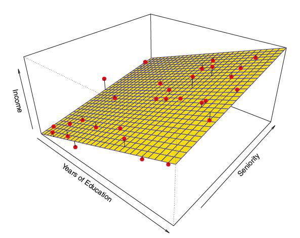
</center>


**(2)非参数方法**

非参数方法不需要对函数f 的形式事先做明确的假设。相反，这类方法追求的是接近数据点的估计，估计函数在去粗和光滑处理后尽可能与更多的数据点接近。非参数方法较参数方法的优点表现为:不限定函数f 的具体形式，于是可能在更大的范围选择更适宜f 形状的估计。

非参数方法有一个致命的弱点:无法将估计f 的问题简化到仅仅对少数参数进行估计的问题，所以为了获得对f 更为精准的估计，往往需要大量的观测点(远远超出参数方法所需要的点)。


#### 2.1.3 预测精度和模型解释性的权衡


众多估计方法中存在一类欠光滑的（形式受限定），这些估计方法只能在一个相对较窄的函数形状范围内来估计f。当数据分析的目标是推断的时候，运用简单又相对欠光滑的统计学习方法具有明显的优势，事实上更精确的预测常常是在欠光滑度的模型上取得的。


<center>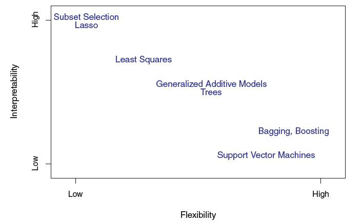
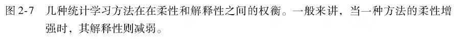</center>


#### 2.1.4 指导学习与无指导学习

(1)指导学习：包括许多传统的统计学习方法，比如线性回归和逻辑斯谛回归(第4章)，以及诸如广义可加模型、提升方法和支持向量机等比较现代的方法。


(2)无指导学习：只有预测变量的观测向量$ X_1,...,X_n$，这些向量没有相应的响应变量$Y$; 与之对应。聚类分析是一种典型的无指导学习，也称聚类。聚类分析的目标是基于$X_1,...,X_n$,将观测归入不同的群。


(3)半指导学习：假设有n 个观测。其中m(m小于n)个观测点，可以同时观测到预测变量和响应变量。而对于其余n-m 个观测点，只能观测到预测变量但无法观测到响应变量。比如对预测变量的采集相对简单，而相应的响应变量却比较难采集的一类问题。


#### 2.1.5 回归与分类问题
(1)变量常分为定量和定性两种类型(定性变量也称为分类变量)。定量变量呈现数值性，定性变量取K个不同类的其中一个值。

(2)我们习惯于将响应变量为定量的问题称为回归分析问题，而将具有定性响应变量的问题定义为分类问题。


(3)根据响应变量是定性的还是定量的来选择所需的统计学习方法是数据分析的常规思维。


(4)当响应变量是定量时，通常选用线性回归模型，当响应变量是定性变量时，用逻辑斯谛回归。


(5) 预测变量是定性的还是定量的，通常对选择模型并不十分重要。如果在分析之前，所有定性变量的取值都已正确编码，无论预测变量是什么类型，本书讨论的大部分统计学习方法大都能够应用。

<center>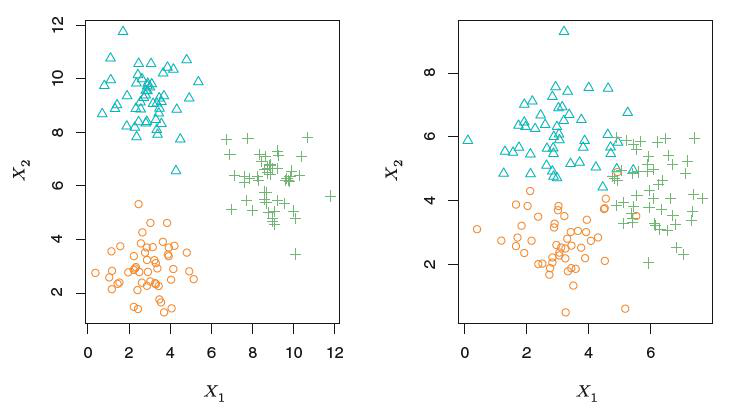
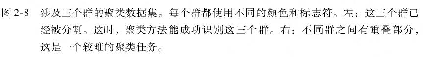</center>


### 2.2 评价模型精度


在实践中，对于每个数据都要判断哪类统计学习方法能产生更好的效果，从而选择最好的方法或模型。


#### 2.2.1 拟合效果检验


定量测量预测的响应值与真实响应值之间的接近程度。


(1)训练均方误差与测试均方误差


对于回归模型，最常用的评价拟合效果准则的是均方误差（MSE)。其中$y_i$为真实值，$\hat{f}(x_i)$是第i个观测点上应用$\hat{f}$的预测值。因为此式是由训练数据计算出的，所以也称为训练均方误差。


$$MSE=\frac{1}{n}\sum_{i=1}^n(y_i-\hat{f}(x_i))^2 $$


在应用中，我们更加关心对于一个之前没有参与建模的新的观测点$(x_0,y_0) $,是否有$ \hat{f}(x_0)\approx y_0$，即要找到一个模型使测试均方误差达到最小。

$$Ave(\hat{f}(x_0)-y_0)^2 $$


(2)如何选择使测试均方误差最小的模型

一个模型使训练均方误差达到最小，并不一定能同时使测试均方误差也很小。当模型的光滑度（即自由度）增加时，训练均方误差将降低，但测试均方误差不一定会降低。当所建的模型产生一个较小的训练均方误差但却有一个较大的测试均方误差，就称该数据被过拟合。


【例】对于一组观测数据，左图黑色曲线代表真实的f函数，橙色、绿色、蓝色曲线代表三种对f的估计。右图灰色线代表训练均方误差，红色线测试均方误差。可以看到，当拟合函数的光滑度增加时，训练均方误差（灰线）单调递减，但测试均方误差（红线）随光滑度增加先减小后增加，呈U型曲线。水平虚线表示的是不可约误差$Var(ε)$，它对应于所有方法的最低的测试均方误差。因此，可以确定蓝色曲线表示的模型是最优的。在实际问题中估计最小测试均方误差的一个重要的方法是交叉验证，是一类用训练数据估计测试均方误差的方法。

​
<center>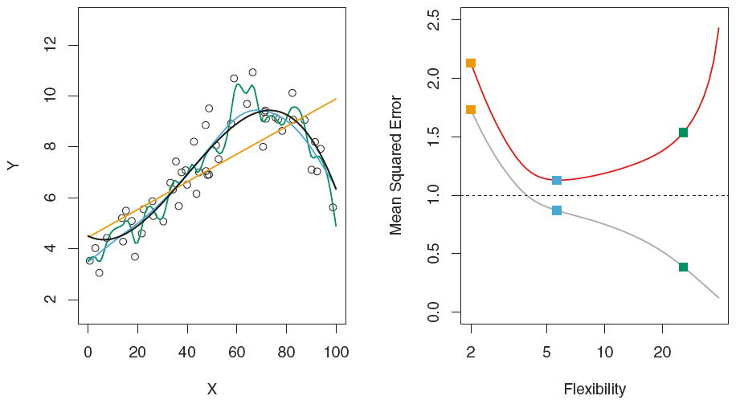</center>


#### 2.2.2 偏差-方差权衡


在给定值$X_0$时，测试均方误差的期望能分解成三个基本量的和，分别为:$\hat{f}(X_0) $的方差、$\hat{f}(X_0) $偏差的平方，以及误差项$ε$的方差。方差代表的是用一个不同的训练数据集估计f 时，估计函数的改变量。偏差指的是选择一个简单的模型逼近真实函数而被带入的误差，其构成可能非常复杂。


$$E(y_0-\hat{f}(x_0))=Var(\hat{f}(x_0))+[Bias(\hat{f}(x_0))]^2+Var(\varepsilon) $$


一般而言，使用光滑度更高的模型，所得的模型方差会增加，偏差会减小。这两个量比值的相对变化率会导致测试均方误差整体的增加或减小。一个测试性能好的模型需要具有较小的方差和较小的偏差，这就会涉及权衡的问题。


【例】三张图分别表示三个数据集的方差(橙色曲线)、偏差平方(蓝色曲线)、不可约误差$Var(ε)$ (虚线)、测试均方误差(红色曲线)随模型光滑度的变化。红色曲线是其他三个量的和，橙色和蓝色曲线增加或减小的比率决定了红色曲线如何变化。

<center>{width=60%}</center>


#### 2.2.3 分类模型


**(1)训练错误率和测试错误率**


对于分类模型，最常用的衡量估计f 精度的方法是训练错误率,也就是对训练数据使用估计模型f 所造成的误差比例。$I(y_i\neq\hat{y}_i)$ 表示一个示性变量,当时$y_i\neq\hat{y}_i$，值等于1；当时$y_i=\hat{y}_i$，值等于0 。


$$\frac{1}{n}\sum_{i=1}^n I(y_i\neq\hat{y}_i)$$


与回归模型同样，在应用中我们更关心测试错误率。其中是实际的分类标签，是用模型预测的分类标签。一个好的分类器应使测试错误率最小。


$$Ave(I(y_i\neq\hat{y}_i))$$

**(2)贝叶斯分类器**

对于一个待判的$x_0$，将其归为某一类的概率为$P(Y=j|X=X_0)$。 贝叶斯分类选择的是每个观测值最大可能所在的类，即$ max_jP(Y=j|X=X_0)$,所以其在$X=x_0$处的错误率是$1-max_jP(Y=j|X=X_0)$。一般来说，整个的贝叶斯错误率是$1-E(max_jP(Y=j|X=X_0))$,其中期望平均了所有X可能值上的概率。


【例】橙色和蓝色的点是来自两个不同类别的训练观测。橙色的阴影部分显示的是Pr( Y = orange | X) 大于50% 的点，而蓝色的区域表示的是概率低于50% 的点。虚线表示了概率等于50%的点，这条线称为贝叶斯决策边界。


<center></center>


**(3)K最近邻（KNN）法则**


对于一个实际的观测数据而言，其实很难知道给定X后Y的条件分布。KNN分类器尝试在给定X后先估计Y的条件分布，然后将一个给定的观测归到估计分布概率最大的类别中。

给一个正整数K和一个测试观测值$x_0$，KNN 分类器从识别训练集中K个最靠近$x_0$的点集开始，用$ N_0$表示K个点的集合，然后对每个类别j分别用$N_0$ 中的点估计一个分值作为条件概率的估计，这个值等于j:

$$P(Y=j|X=x_0)=\frac{1}{K}\sum_{t\in N_0}I(y_i=j) $$

最后，对KNN方法运用贝叶斯规则将测试观测值$x_0$分到概率最大的类中。


【例】左图绘制了一个由6个蓝色和6个橙色观测值组成的训练集。预测黑色十字标记的点属于哪一类。选取K=3，圆圈区域表示KNN首先识别出最靠近黑色十字的三个观测值，蓝色点的估计概率是2/3，橙色点的估计概率是1/3，于是将黑色十字预测为蓝色族。右图表示当K=3时，将KNN方法用于$X_1$和$X_2$中所有可能的值，绘制出相应的KNN决策边界。

<center></center>


K的选择对获得KNN分类器有根本性的影响。K越小，模型光滑度越高，模型方差较大，但偏差较低。如图，当K=1和K=100时，决策边界不同。


<center>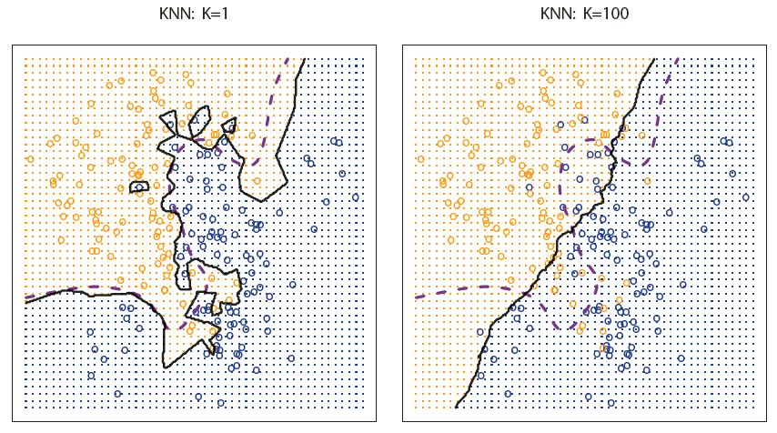</center>


与回归模型一样，当使用光滑度较高的分类方法时，训练错误率将减小，但测试错误率则不一定很小。下图中蓝色线为训练错误率，橙色线为测试错误率，虚线为贝叶斯错误率。随着1/K的增加（即K减小），模型光滑度提高，训练错误率递减，而测试错误率先递减后递增。

​
<center></center>


### 2.3 实验:R 语言简介


#### 2.3.1 基本命令


定义一个数值向量的方式:

```r
x<-c(1,2,3,4);x
```

```
## [1] 1 2 3 4
```

```r
y=c(2,3,4,5);y
```

```
## [1] 2 3 4 5
```


式中c表示连接内部的数值，x是定义的向量名，上面显示的>不是命令的一部分，只是标识符，表示R已经准备好接受下一个命令。


补充说明：在R中我们可以通过多次按向上的箭头来显示前面己输入的命令，用户可以对这些命令重新编辑。用户可以通过输入？+想要查询的函数名来查看该函数的帮助文档，比如输入?funcname 就可以查看有关函数funcname的更多信息。


我们可以用R进行两数值向量的求和运算。但这建立在两向量的长度一样的前提下，在R中查看向量长度的函数是length()。我们需要先查看向量长度是否一致，再对向量进行求和运算。


```r
length(x)
```

```
## [1] 4
```

```r
length(y)
```

```
## [1] 4
```

```r
x+y
```

```
## [1] 3 5 7 9
```


在R中我们可以用ls()查看所有的对象列表，用函数rm()可以从对象列表中删除那些我们不想要的对象。如果要同时删除所有对象列表中的对象，我们可以用rm(list=ls())来实现。


```r
ls()
```

```
## [1] "x" "y"
```

```r
rm(x,y)
ls()
```

```
## character(0)
```

```r
rm(list=ls())
ls()
```

```
## character(0)
```


建立数值矩阵需要用的函数是matrix()函数，我们用？matrix来获取该函数的用法:


```r
matrix(data = NA,nrow = 1,ncol = 1,byrow = FALSE,dimnames = NULL)
```

```
##      [,1]
## [1,]   NA
```


其中data参数是设置数据向量的，nrow参数是设置矩阵行数的，ncol参数是设置矩阵列数的，byrow=FALSE是表示默认数据按列排列，dimnames是设置矩阵的行名和列名的。下面我们通过一个实例对该函数的应用进行说明：


```r
matrix(c(1,6,9,2),2,2,byrow = TRUE)
```

```
##      [,1] [,2]
## [1,]    1    6
## [2,]    9    2
```


在参数设置中byrow=TRUE表明数据是按行排列的，需要注意的是，在输入上面的命令时，我们没有将这个矩阵赋值给一个对象，这就意味着这个矩阵仅仅是用于打印在屏幕上而不能为将来计算所用。


sqrt ()函数可以对一个向量或矩阵中的每个元素开方。


```r
x=matrix(c(1,2,3,4),nrow = 2,ncol = 2)
x
```

```
##      [,1] [,2]
## [1,]    1    3
## [2,]    2    4
```

```r
sqrt(x)
```

```
##          [,1]     [,2]
## [1,] 1.000000 1.732051
## [2,] 1.414214 2.000000
```

```r
y=c(1,4,9,16)
sqrt(y)
```

```
## [1] 1 2 3 4
```


命令x^2或者x**2用来计算x中每个元素的2次幂;但是任意次幂都是可能的，包括小数次幂和负次幂。


```r
x^2
```

```
##      [,1] [,2]
## [1,]    1    9
## [2,]    4   16
```

```r
x**2
```

```
##      [,1] [,2]
## [1,]    1    9
## [2,]    4   16
```

```r
x^1.8
```

```
##          [,1]      [,2]
## [1,] 1.000000  7.224674
## [2,] 3.482202 12.125733
```

```r
x**1.8
```

```
##          [,1]      [,2]
## [1,] 1.000000  7.224674
## [2,] 3.482202 12.125733
```


rnorm()函数可以产生一个随机正态变量的向量，函数中的第一个参数是样本的容量,第二个参数是生成的正态随机变量的均值,第三个参数是生成的正态随机变量的标准差,在第二、第三参数缺省时，生成的标准正态变量的向量。每次调用这个函数时，都会产生不同的结果。


```r
rnorm(10)
```

```
##  [1] -1.2304999  0.4081685 -1.2052690  0.3825409 -0.1372028  0.2992457
##  [7]  0.0749808 -1.6470728 -0.1956568  1.1595331
```

```r
rnorm(10)
```

```
##  [1]  0.31480005  0.19268756 -0.79564998 -0.39982639 -0.95728862
##  [6] -0.47176034 -0.44699134 -0.82815213 -1.32034764 -0.03884416
```


我们可以用cor()函数计算两个相关的数值变量x和y之间的相关系数。


```r
x=rnorm(50)
y=x+rnorm(50,mean=50,sd=0.1)
cor(x,y)
```

```
## [1] 0.9910347
```


有时候我们希望代码产生完全相同的一组随机数，可以用set. seed ()函数去做。set. seed ()函数中的参数可以是任意整数。只要set.seed()函数内部的整数值一样，调用rnorm(n)得到的向量就完全一样。


```r
set.seed(123)
rnorm(10)
```

```
##  [1] -0.56047565 -0.23017749  1.55870831  0.07050839  0.12928774
##  [6]  1.71506499  0.46091621 -1.26506123 -0.68685285 -0.44566197
```

```r
set.seed(123)
rnorm(10)
```

```
##  [1] -0.56047565 -0.23017749  1.55870831  0.07050839  0.12928774
##  [6]  1.71506499  0.46091621 -1.26506123 -0.68685285 -0.44566197
```


mean()函数和var()函数分别可以计算向量的均值和方差，结合var()函数和sqrt()函数可以计算向量的标准差，也可直接运用sd()函数，实例如下：


```r
set.seed(3)
y=rnorm(100)
mean(y)
```

```
## [1] 0.01103557
```

```r
var(y)
```

```
## [1] 0.7328675
```

```r
sqrt(var(y))
```

```
## [1] 0.8560768
```

```r
sd(y)
```

```
## [1] 0.8560768
```


#### 2.3.2 图形


在绘图中我们最常用的方法是plot()函数，比如我们可以用plot(x,y)产生一个数据x对于数据y的散点图。plot()函数内有许多可自选的设置参数，例如加入参数xlab可以改变横坐标的标题。具体的自选参数可以通过? plot找到。实例如下：


```r
x=rnorm(100)
y=rnorm(100)
plot(x,y)
```

<!-- -->

```r
plot(x,y,xlab = 'this is a X-axis',ylab = 'this is a y-axis',main = 'plot of X vs Y')
```

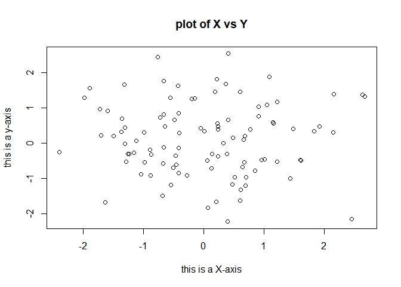<!-- -->


我们可以保存R输出的图，用pdf()函数可以建立一个pdf文件，而用jpeg()函数建立一个jpeg格式的输出文件。


```r
x=rnorm(100)
y=rnorm(100)
#setwd('C:\\Users\\Administrator\\Desktop')
pdf('figure1.pdf')
plot(x,y,col = 'green')
dev.off()
```

```
## png
##   2
```


函数dev. off()表示用R创建图形的工作到此为止。另外一种比较简单的方式是将这个图形窗口里的图形复制粘贴到一个合适的文件类型里，例如一个word 文件。


函数seq ()可用来创建一个序列。例如，seq(a,b)是在a和b之间建立一个整数向量,其中有许多参数选项,例如,seq(0,1,length=10) 建立一个在0 和l 之间等距的10 个数的序列，seq(0,1,by=0.1) 建立一个在0 和l 之间步长为0.1的序列,输入3: 11 是seq (3: 11) 的一个速记法，两种写法输出一样。


```r
x=seq(1:10)
x
```

```
##  [1]  1  2  3  4  5  6  7  8  9 10
```

```r
x=1:10
x
```

```
##  [1]  1  2  3  4  5  6  7  8  9 10
```

```r
x=seq(1,5,by=0.5);x
```

```
## [1] 1.0 1.5 2.0 2.5 3.0 3.5 4.0 4.5 5.0
```

```r
x=seq(1,10,length = 20);x
```

```
##  [1]  1.000000  1.473684  1.947368  2.421053  2.894737  3.368421  3.842105
##  [8]  4.315789  4.789474  5.263158  5.736842  6.210526  6.684211  7.157895
## [15]  7.631579  8.105263  8.578947  9.052632  9.526316 10.000000
```


#### 2.3.3 索引数据


经常需要考察一组数据的其中一部分。假设数据保存在一个矩阵A 里。


```r
A=matrix(1:16,4,4)
A
```

```
##      [,1] [,2] [,3] [,4]
## [1,]    1    5    9   13
## [2,]    2    6   10   14
## [3,]    3    7   11   15
## [4,]    4    8   12   16
```

```r
A[2,3]
```

```
## [1] 10
```


A[2,3]表示选择矩阵A中第2 行第3列所对应的元素。中括号的第一个数指示的是行，第二个数指示的是列。有的时候可以选择多行多列，通过设置向量作为选择的指标集。


```r
A[c(1,3),c(2,4)]
```

```
##      [,1] [,2]
## [1,]    5   13
## [2,]    7   15
```

```r
A[1:3,2:3]
```

```
##      [,1] [,2]
## [1,]    5    9
## [2,]    6   10
## [3,]    7   11
```

```r
A[1:2,]
```

```
##      [,1] [,2] [,3] [,4]
## [1,]    1    5    9   13
## [2,]    2    6   10   14
```

```r
A[,1:2]
```

```
##      [,1] [,2]
## [1,]    1    5
## [2,]    2    6
## [3,]    3    7
## [4,]    4    8
```


最后的两个例子表示的是要么只有行没有列的索引要么只有列没有行的索引。在R 中这样的设置表示包含所有的列或所有的行。R 中把一个单行或单列称为一个向量。在索引里用一个负号"-"告诉R 不包含指示的行或列。dim ()函数输出一个矩阵的行数和列数。


```r
dim(A)
```

```
## [1] 4 4
```


#### 2.3.4 载入数据


大部分数据分析的第一步，需要先将一个数据集导入到R中，read.table()函数是最基本的方法之一，用write. table ()函数可输出数据。

在试图加载一个数据之前，必须确保R 知道所要搜寻的数据所在的日录。例如在Windows系统里可以在File 菜单下用Change dir… 选项去选择目录。

现在需要载入data数据集。该数据是自己新建的，存在目录C:\Users\Administrator\Desktop下，用read. table ( )函数将该数据从一个文本文件加载到R 中。下面的命令将data.txt 文件载入R ，储存它并将其命名为data，该数据的格式为数据框( data frame),当该数据被载入后，用fix ()函数可以开启一个电子表格窗口来浏览数据。然而，在有新的R 命令被应用之前这个窗口需要被关闭。


```r
#setwd('C:\\Users\\Administrator\\Desktop')
data=read.table('data.txt');data
```

```
##   V1 V2 V3 V4
## 1  a  b  c  d
## 2  1  2  3 45
## 3  1  3  4 56
## 4  3  4  5 66
```

```r
data=read.table('data.txt',header = T);data
```

```
##   a b c  d
## 1 1 2 3 45
## 2 1 3 4 56
## 3 3 4 5 66
```

```r
str(data)
```

```
## 'data.frame':	3 obs. of  4 variables:
##  $ a: int  1 1 3
##  $ b: int  2 3 4
##  $ c: int  3 4 5
##  $ d: int  45 56 66
```

```r
fix(data)
```


当某个数据集被正确加载后，因为R 假定变量名称也是数据的一部分，所以会在数据的第一行列出这些变量名。该数据集还有大量缺失观测值，用问号?表示缺失数据。缺失数据在实际问题中是一种比较普遍的现象。在read. table ( )函数里用选项header = T (或header = TRUE) 告知R ，文件的第一行包含变量名，用选项口s. strings 告知R 在扫描数据的任何位置只要遇到指定的字符特征或者一个特征集(如问号标记) ，应该在数据矩阵中对这条数据做缺失标记。


Excel 是一种常见的数据存储程序。如果数据被保存成一个csv 文件(以"，"分隔的数据文件) ，那么可以用read. csv ()函数很容易将数据载入R,在read.table()函数中设定sep=”,”也是一样的。


```r
#setwd('C:\\Users\\Administrator\\Desktop')
read.csv('sample-data.csv',header = T)
```

```
##   ID name gender age height weight
## 1  1    A      F  14    156   42.0
## 2  2    B      M  15    165   49.0
## 3  3    C      F  16    157   41.5
## 4  4    D      M  14    162   52.0
## 5  5    E      F  15    159   45.5
```

```r
read.csv('sample-data.csv')
```

```
##   ID name gender age height weight
## 1  1    A      F  14    156   42.0
## 2  2    B      M  15    165   49.0
## 3  3    C      F  16    157   41.5
## 4  4    D      M  14    162   52.0
## 5  5    E      F  15    159   45.5
```

```r
data=read.csv('sample-data.csv')
fix(data)
dim(data)
```

```
## [1] 5 6
```


如果数据中含有缺失值，我们可以通过na.omit()函数去除包含缺失值的观测。


```r
data[6,c(1,2,5)]=c(1,2,NA)
```

```
## Warning in `[<-.factor`(`*tmp*`, iseq, value = 2): invalid factor level, NA
## generated
```

```r
data
```

```
##   ID name gender age height weight
## 1  1    A      F  14    156   42.0
## 2  2    B      M  15    165   49.0
## 3  3    C      F  16    157   41.5
## 4  4    D      M  14    162   52.0
## 5  5    E      F  15    159   45.5
## 6  1 <NA>   <NA>  NA     NA     NA
```

```r
na.omit(data)
```

```
##   ID name gender age height weight
## 1  1    A      F  14    156   42.0
## 2  2    B      M  15    165   49.0
## 3  3    C      F  16    157   41.5
## 4  4    D      M  14    162   52.0
## 5  5    E      F  15    159   45.5
```


当这些数据被准确载入后，可以用narnes ()查看该数据的变量名。


```r
names(data)
```

```
## [1] "ID"     "name"   "gender" "age"    "height" "weight"
```


#### 2.3.5 其他的图形和数据汇总


在调用数据集中的某列属性值时，只说姓名是不能正确的调用该属性列的，正确的做法是用数据集$属性列的方式调用，或者用attach(属性集)释放属性，然后调用属性名即可。


```r
plot(data$ID,data$age)
```

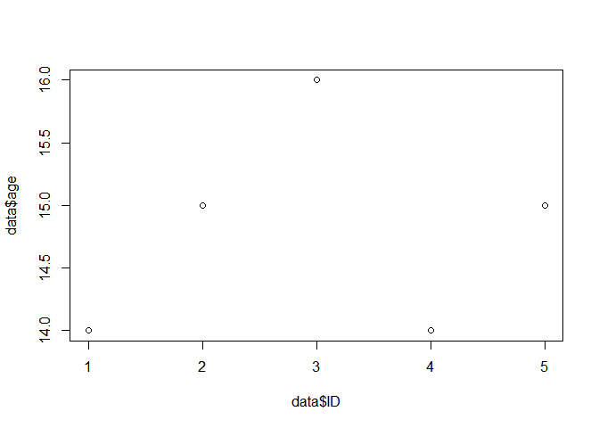<!-- -->

```r
attach(data)
plot(ID,age)
```

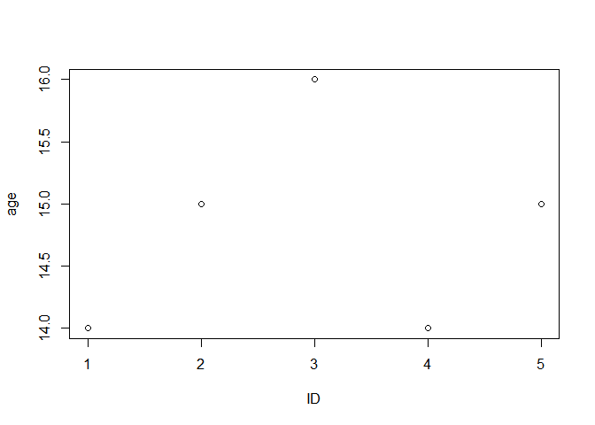<!-- -->


我们可以用as. factor ()函数将一个定量的变量转换成一个定性的变量


```r
data$ID=as.factor(data$ID)
str(data)
```

```
## 'data.frame':	6 obs. of  6 variables:
##  $ ID    : Factor w/ 5 levels "1","2","3","4",..: 1 2 3 4 5 1
##  $ name  : Factor w/ 5 levels "A","B","C","D",..: 1 2 3 4 5 NA
##  $ gender: Factor w/ 2 levels "F","M": 1 2 1 2 1 NA
##  $ age   : num  14 15 16 14 15 NA
##  $ height: num  156 165 157 162 159 NA
##  $ weight: num  42 49 41.5 52 45.5 NA
```


如果要绘制在x 轴上的变量是定性的，箱线图( boxplot) 将自动通过plot ()函数产生。


```r
plot(data$ID,data$age)
```

<!-- -->

```r
plot(data$ID,data$age,col='red')
```

<!-- -->

```r
plot(data$ID,data$age,col='red',varwidth = T)
plot(data$ID,data$age,col='red',varwidth = T,xlab='ID',ylab='age')
```

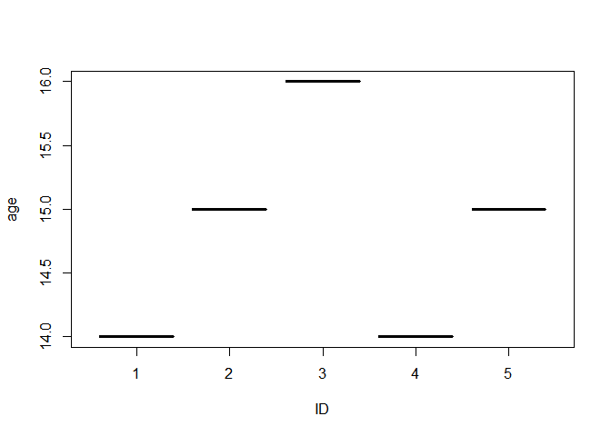<!-- -->

```r
hist(data$age,col=2,breaks=15)
```

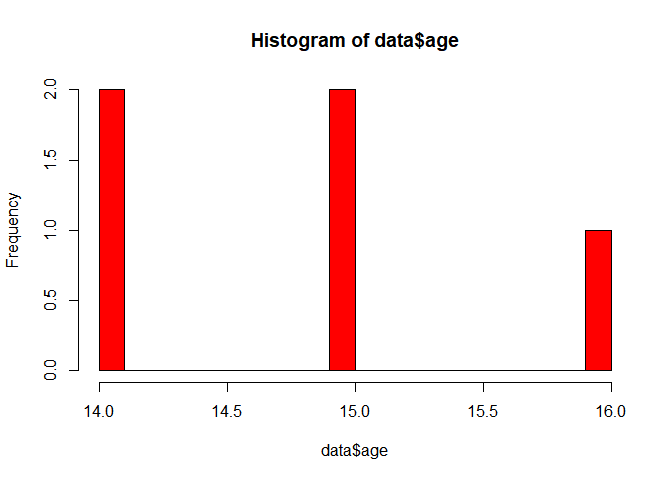<!-- -->


hist ()函数可以被用来绘制直方图。注意col =2 与col ="red" 两条语句效果是一样的。

pairs ()函数可用于建立一个对任何指定数据集中每一对变量的散点图矩阵。我们也可以为这些变量的子集产生一个散点图。


```r
pairs(data)
```

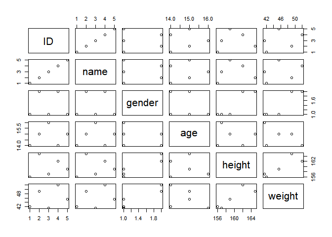<!-- -->

```r
pairs(~gender+age)
```

<!-- -->


紧随plot ()函数之后的identify ()函数提供了一个有用的交互识别方法，可以对图上的每个点指定显示某个变量值。例子中在identify ()输入了三个参数: x 轴变量， y 轴变量，以及我们希望在屏幕上为每个数据点打印出的变量名称。单击一个图上的某个点将引导R 打印指定变量上这个点的值。右击这个图将退出identify ()函数。默认情况下，在identify ()函数下显示的数字代表这个点的行号。


```r
attach(data)
```

```
## The following objects are masked from data (pos = 3):
##
##     age, gender, height, ID, name, weight
```

```r
plot(age,height)
identify(age,height,weight)
```

<!-- -->

```
## integer(0)
```


在一个指定数据集中， summary ()函数对每个变量给出一个数值汇总(描述统计信息)。对于定性变量如name ， R 将列出那些落在每个类别里的观测个数信息。也可以对数值变量产生一个汇总统计。


```r
summary(gender)
```

```
##    F    M NA's
##    3    2    1
```

```r
summary(age)
```

```
##    Min. 1st Qu.  Median    Mean 3rd Qu.    Max.    NA's
##    14.0    14.0    15.0    14.8    15.0    16.0       1
```

```r
summary(data)
```

```
##  ID      name    gender       age           height          weight
##  1:2   A   :1   F   :3   Min.   :14.0   Min.   :156.0   Min.   :41.5
##  2:1   B   :1   M   :2   1st Qu.:14.0   1st Qu.:157.0   1st Qu.:42.0
##  3:1   C   :1   NA's:1   Median :15.0   Median :159.0   Median :45.5
##  4:1   D   :1            Mean   :14.8   Mean   :159.8   Mean   :46.0
##  5:1   E   :1            3rd Qu.:15.0   3rd Qu.:162.0   3rd Qu.:49.0
##        NA's:1            Max.   :16.0   Max.   :165.0   Max.   :52.0
##                          NA's   :1      NA's   :1       NA's   :1
```


当用R 完成分析时，可以输入q() 关闭它，或者退出。当退出R 时，可以选择保存当前工作区，这样就对下次使用这次R 会话里已经创建的所有的对象(如数据集)做了布置。在退出R 之前，可以用savehistory ()函数将最近会话里输入的所有命令都保存成一个记录;下次进入R 时，可以用loadhistory ()函数载入这些历史记录。


## 习题

###8
（a） 导入数据

```r
library('ISLR')
data(College)
```

（b）修改第一列为行名

```r
fix(College)
```

（c）

```r
attach(College)
```

（c）i 查看每列的情况

```r
summary(College)
```

```
##  Private        Apps           Accept          Enroll       Top10perc
##  No :212   Min.   :   81   Min.   :   72   Min.   :  35   Min.   : 1.00
##  Yes:565   1st Qu.:  776   1st Qu.:  604   1st Qu.: 242   1st Qu.:15.00
##            Median : 1558   Median : 1110   Median : 434   Median :23.00
##            Mean   : 3002   Mean   : 2019   Mean   : 780   Mean   :27.56
##            3rd Qu.: 3624   3rd Qu.: 2424   3rd Qu.: 902   3rd Qu.:35.00
##            Max.   :48094   Max.   :26330   Max.   :6392   Max.   :96.00
##    Top25perc      F.Undergrad     P.Undergrad         Outstate
##  Min.   :  9.0   Min.   :  139   Min.   :    1.0   Min.   : 2340
##  1st Qu.: 41.0   1st Qu.:  992   1st Qu.:   95.0   1st Qu.: 7320
##  Median : 54.0   Median : 1707   Median :  353.0   Median : 9990
##  Mean   : 55.8   Mean   : 3700   Mean   :  855.3   Mean   :10441
##  3rd Qu.: 69.0   3rd Qu.: 4005   3rd Qu.:  967.0   3rd Qu.:12925
##  Max.   :100.0   Max.   :31643   Max.   :21836.0   Max.   :21700
##    Room.Board       Books           Personal         PhD
##  Min.   :1780   Min.   :  96.0   Min.   : 250   Min.   :  8.00
##  1st Qu.:3597   1st Qu.: 470.0   1st Qu.: 850   1st Qu.: 62.00
##  Median :4200   Median : 500.0   Median :1200   Median : 75.00
##  Mean   :4358   Mean   : 549.4   Mean   :1341   Mean   : 72.66
##  3rd Qu.:5050   3rd Qu.: 600.0   3rd Qu.:1700   3rd Qu.: 85.00
##  Max.   :8124   Max.   :2340.0   Max.   :6800   Max.   :103.00
##     Terminal       S.F.Ratio      perc.alumni        Expend
##  Min.   : 24.0   Min.   : 2.50   Min.   : 0.00   Min.   : 3186
##  1st Qu.: 71.0   1st Qu.:11.50   1st Qu.:13.00   1st Qu.: 6751
##  Median : 82.0   Median :13.60   Median :21.00   Median : 8377
##  Mean   : 79.7   Mean   :14.09   Mean   :22.74   Mean   : 9660
##  3rd Qu.: 92.0   3rd Qu.:16.50   3rd Qu.:31.00   3rd Qu.:10830
##  Max.   :100.0   Max.   :39.80   Max.   :64.00   Max.   :56233
##    Grad.Rate
##  Min.   : 10.00
##  1st Qu.: 53.00
##  Median : 65.00
##  Mean   : 65.46
##  3rd Qu.: 78.00
##  Max.   :118.00
```

（c）ii 绘制pair图

```r
pairs(College[,1:10])
```

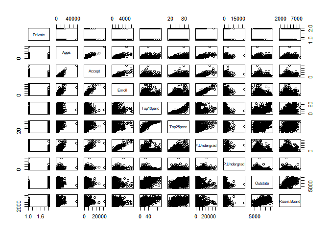<!-- -->

（c）iii 绘制outstate~private箱线图

```r
plot(Outstate~Private,main='outstate~private箱线图')
```

<!-- -->

（c）iv 创建Elite变量

```r
Elite =rep ("No",nrow(College ))
Elite [College$Top10perc >50]="Yes"
Elite =as.factor (Elite)
college =data.frame(College ,Elite)
summary(Elite) #78
```

```
##  No Yes
## 699  78
```

```r
plot(Outstate~Elite,main='Outstate~Elite箱线图') #绘制图
```

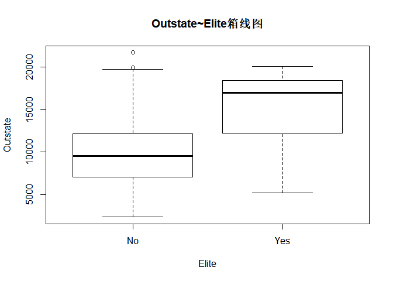<!-- -->

```r
colnames(College)
```

```
##  [1] "Private"     "Apps"        "Accept"      "Enroll"      "Top10perc"
##  [6] "Top25perc"   "F.Undergrad" "P.Undergrad" "Outstate"    "Room.Board"
## [11] "Books"       "Personal"    "PhD"         "Terminal"    "S.F.Ratio"
## [16] "perc.alumni" "Expend"      "Grad.Rate"
```

```r
par(mfrow=c(2,2))
summary(College)
```

```
##  Private        Apps           Accept          Enroll       Top10perc
##  No :212   Min.   :   81   Min.   :   72   Min.   :  35   Min.   : 1.00
##  Yes:565   1st Qu.:  776   1st Qu.:  604   1st Qu.: 242   1st Qu.:15.00
##            Median : 1558   Median : 1110   Median : 434   Median :23.00
##            Mean   : 3002   Mean   : 2019   Mean   : 780   Mean   :27.56
##            3rd Qu.: 3624   3rd Qu.: 2424   3rd Qu.: 902   3rd Qu.:35.00
##            Max.   :48094   Max.   :26330   Max.   :6392   Max.   :96.00
##    Top25perc      F.Undergrad     P.Undergrad         Outstate
##  Min.   :  9.0   Min.   :  139   Min.   :    1.0   Min.   : 2340
##  1st Qu.: 41.0   1st Qu.:  992   1st Qu.:   95.0   1st Qu.: 7320
##  Median : 54.0   Median : 1707   Median :  353.0   Median : 9990
##  Mean   : 55.8   Mean   : 3700   Mean   :  855.3   Mean   :10441
##  3rd Qu.: 69.0   3rd Qu.: 4005   3rd Qu.:  967.0   3rd Qu.:12925
##  Max.   :100.0   Max.   :31643   Max.   :21836.0   Max.   :21700
##    Room.Board       Books           Personal         PhD
##  Min.   :1780   Min.   :  96.0   Min.   : 250   Min.   :  8.00
##  1st Qu.:3597   1st Qu.: 470.0   1st Qu.: 850   1st Qu.: 62.00
##  Median :4200   Median : 500.0   Median :1200   Median : 75.00
##  Mean   :4358   Mean   : 549.4   Mean   :1341   Mean   : 72.66
##  3rd Qu.:5050   3rd Qu.: 600.0   3rd Qu.:1700   3rd Qu.: 85.00
##  Max.   :8124   Max.   :2340.0   Max.   :6800   Max.   :103.00
##     Terminal       S.F.Ratio      perc.alumni        Expend
##  Min.   : 24.0   Min.   : 2.50   Min.   : 0.00   Min.   : 3186
##  1st Qu.: 71.0   1st Qu.:11.50   1st Qu.:13.00   1st Qu.: 6751
##  Median : 82.0   Median :13.60   Median :21.00   Median : 8377
##  Mean   : 79.7   Mean   :14.09   Mean   :22.74   Mean   : 9660
##  3rd Qu.: 92.0   3rd Qu.:16.50   3rd Qu.:31.00   3rd Qu.:10830
##  Max.   :100.0   Max.   :39.80   Max.   :64.00   Max.   :56233
##    Grad.Rate
##  Min.   : 10.00
##  1st Qu.: 53.00
##  Median : 65.00
##  Mean   : 65.46
##  3rd Qu.: 78.00
##  Max.   :118.00
```

（c）v

```r
hist(Apps,breaks=10);hist(Accept);hist(Enroll);hist(Top10perc,breaks=20)
```

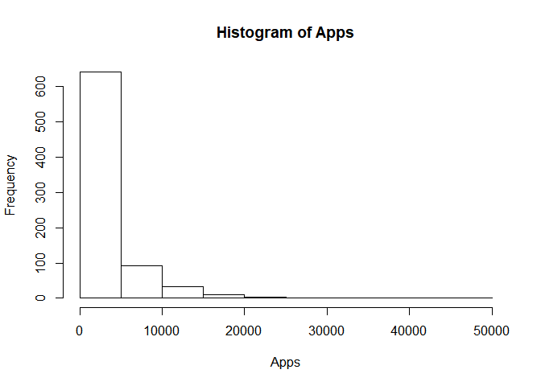<!-- --><!-- -->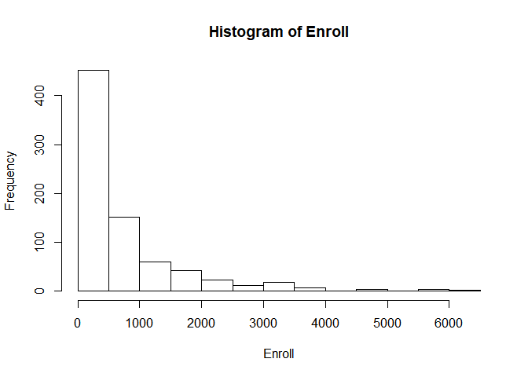<!-- -->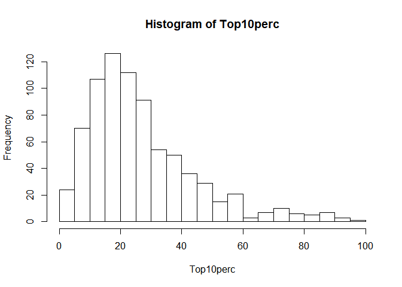<!-- -->

```r
hist(Top25perc,breaks=20);hist(F.Undergrad,breaks=10);hist(P.Undergrad);hist(Outstate,breaks=20)
```

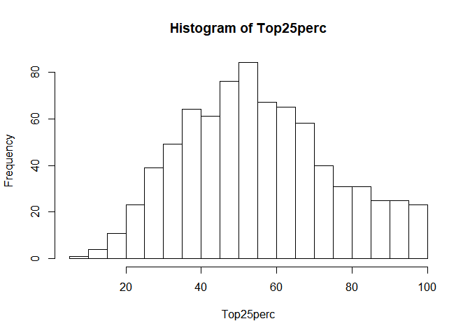<!-- -->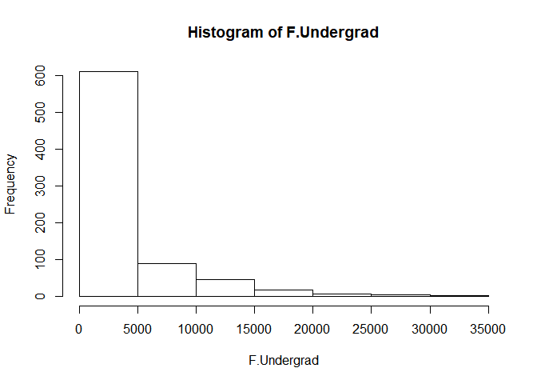<!-- --><!-- -->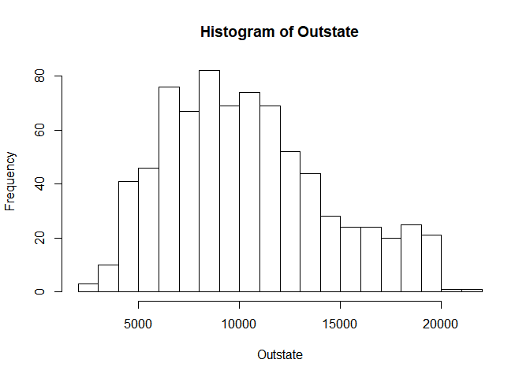<!-- -->

```r
hist(Room.Board);hist(Books,breaks=15);hist(Personal);hist(PhD,breaks=20)
```

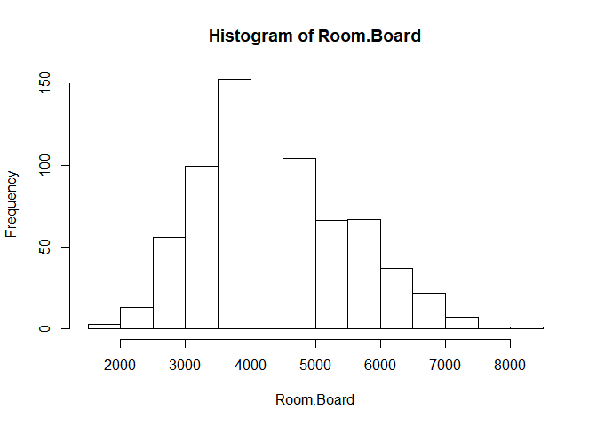<!-- -->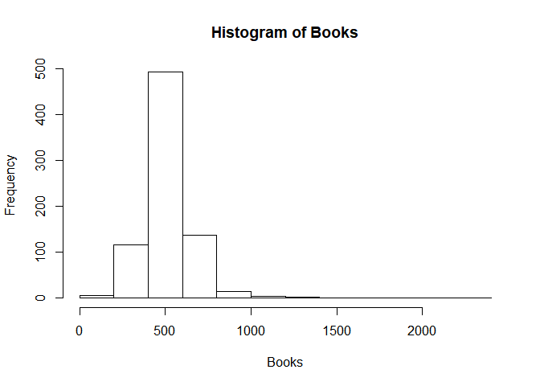<!-- --><!-- -->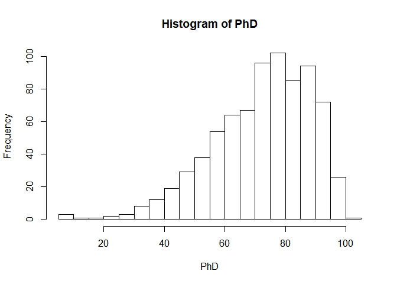<!-- -->

```r
hist(Terminal);hist(S.F.Ratio);hist(perc.alumni,breaks = 20);hist(Expend)
```

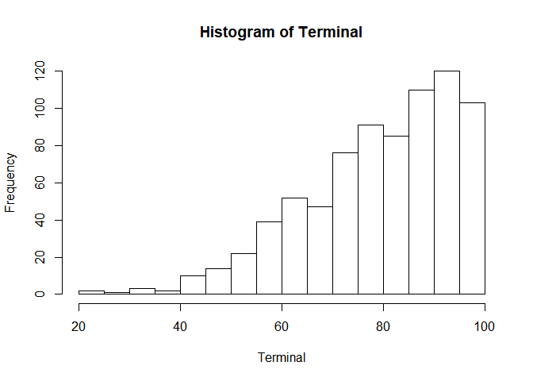<!-- --><!-- --><!-- --><!-- -->

```r
par(mfrow=c(1,1))
hist(Grad.Rate)
```

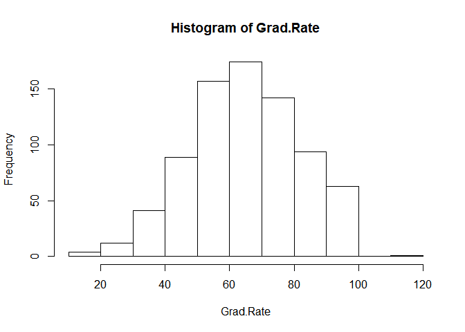<!-- -->

（c）vi

我们绘制了outstate和private的箱线图，可以发现，当private为yes时候，oustate值明显偏高，即私立大学征收非本州学生学费明显高于公立学校， Elite=Yes含义是“有超过50%的学生来自排名在10%顶尖高中”的大学，也就是说这些是全美非常优秀的大学，总共78所。同时可以发现，越顶尖的大学，对非本州学生的学费明显高于普通大学。


直方图分析：大部分大学招收的排名前10%的高中的学生比例<40%，但招收的排名前25%的高中的学生比例却比较均匀，近似于正态分布，但稍微左偏。  住宿车船费则近似正态分布，主要区间为2500~7000，总体来看，分布的差距也是比较大的。个人消费的范围主要集中在1000到3000之间，但也存在7000以上的高消费。个人消费一般需要考虑的所处的地理位置，州的经济状况，个人的消费习惯等等因素。 至于毕业率就是更有意思的一件事了，有的学校能近似达到100%，但是有的学校连20%都达不到。我们确实有些好奇，这些学校是不是因为太优秀，所以学生的毕业率普遍偏低？因此我们特意选取78所顶尖大学进行毕业率分析，结果显示，这些顶尖大学的毕业率均达到50%以上，而且顶尖大学毕业率中位数达到84.5%。看来我们的猜测是错误的，优秀的学生到哪里都是优秀的，所以在顶尖大学里，毕业率依然很高，不存在因为优秀大学所以难毕业的问题。当然这里并没有专门分析博士毕业率，或许在顶尖大学里，博士的毕业率会有另一番结论。


```r
data2<-subset(college,Elite=='Yes')
hist(data2$Grad.Rate)
```

<!-- -->

```r
summary(data2$Grad.Rate)
```

```
##    Min. 1st Qu.  Median    Mean 3rd Qu.    Max.
##   51.00   74.25   84.50   83.38   93.00  100.00
```


###9.


该实验将对 Auto数据集进行研究。首先确认有缺失数据的行已经从该数据中删除了。


（a）哪些预测变量是定量的，哪些是定性的？


变量有mpg、cylinders、displacement、horsepower、weight、acceleration、year、origin、name，其中origin和name是定性变量，其他的是定量变量。


```r
library(MASS)
library(ISLR)
library(car)
```

```
## Loading required package: carData
```

```r
Auto=na.omit(Auto)
summary(Auto)
```

```
##       mpg          cylinders      displacement     horsepower
##  Min.   : 9.00   Min.   :3.000   Min.   : 68.0   Min.   : 46.0
##  1st Qu.:17.00   1st Qu.:4.000   1st Qu.:105.0   1st Qu.: 75.0
##  Median :22.75   Median :4.000   Median :151.0   Median : 93.5
##  Mean   :23.45   Mean   :5.472   Mean   :194.4   Mean   :104.5
##  3rd Qu.:29.00   3rd Qu.:8.000   3rd Qu.:275.8   3rd Qu.:126.0
##  Max.   :46.60   Max.   :8.000   Max.   :455.0   Max.   :230.0
##
##      weight      acceleration        year           origin
##  Min.   :1613   Min.   : 8.00   Min.   :70.00   Min.   :1.000
##  1st Qu.:2225   1st Qu.:13.78   1st Qu.:73.00   1st Qu.:1.000
##  Median :2804   Median :15.50   Median :76.00   Median :1.000
##  Mean   :2978   Mean   :15.54   Mean   :75.98   Mean   :1.577
##  3rd Qu.:3615   3rd Qu.:17.02   3rd Qu.:79.00   3rd Qu.:2.000
##  Max.   :5140   Max.   :24.80   Max.   :82.00   Max.   :3.000
##
##                  name
##  amc matador       :  5
##  ford pinto        :  5
##  toyota corolla    :  5
##  amc gremlin       :  4
##  amc hornet        :  4
##  chevrolet chevette:  4
##  (Other)           :365
```


（b）每个定量预测变量的取值范围是什么?可以用 range() 函数回答。


```r
datarange<-function(data,endnum){
  result = c()
  for (i in 1:endnum){
    result=rbind(result,
                 (paste(names(data)[i],paste(range(data[,i]),collapse = '-'),sep=':    '))
                 )
    }
  colnames(result) = 'range'
  return(result)
}
datarange(Auto,dim(Auto)[2]-1)
```

```
##      range
## [1,] "mpg:    9-46.6"
## [2,] "cylinders:    3-8"
## [3,] "displacement:    68-455"
## [4,] "horsepower:    46-230"
## [5,] "weight:    1613-5140"
## [6,] "acceleration:    8-24.8"
## [7,] "year:    70-82"
## [8,] "origin:    1-3"
```

（c）每个定量预测变量的均值和方差是多少?


```r
datameanvar<-function(data,endnum){
  result = c()
  for (i in 1:endnum){
    result=rbind(result,paste(names(data)[i],
              paste(paste('mean',round(mean(data[,i]),2)),
                    paste('var',round(var(data[,i])))),sep=':    ')
              )
    }
  colnames(result) = 'mean and var'
  return(result)
}
datameanvar(Auto,dim(Auto)[2]-1)
```

```
##      mean and var
## [1,] "mpg:    mean 23.45 var 61"
## [2,] "cylinders:    mean 5.47 var 3"
## [3,] "displacement:    mean 194.41 var 10950"
## [4,] "horsepower:    mean 104.47 var 1482"
## [5,] "weight:    mean 2977.58 var 721485"
## [6,] "acceleration:    mean 15.54 var 8"
## [7,] "year:    mean 75.98 var 14"
## [8,] "origin:    mean 1.58 var 1"
```

（d）现在剔除第10个和第85个观测。剔除后数据的子集中的每个预测变量的取值范围、均值、标准差是多少?


```r
datarange(Auto[c(-10,-85)],dim(Auto)[2]-1)
```

```
##      range
## [1,] "mpg:    9-46.6"
## [2,] "cylinders:    3-8"
## [3,] "displacement:    68-455"
## [4,] "horsepower:    46-230"
## [5,] "weight:    1613-5140"
## [6,] "acceleration:    8-24.8"
## [7,] "year:    70-82"
## [8,] "origin:    1-3"
```

```r
datameanvar(Auto[c(-10,-85)],dim(Auto)[2]-1)
```

```
##      mean and var
## [1,] "mpg:    mean 23.45 var 61"
## [2,] "cylinders:    mean 5.47 var 3"
## [3,] "displacement:    mean 194.41 var 10950"
## [4,] "horsepower:    mean 104.47 var 1482"
## [5,] "weight:    mean 2977.58 var 721485"
## [6,] "acceleration:    mean 15.54 var 8"
## [7,] "year:    mean 75.98 var 14"
## [8,] "origin:    mean 1.58 var 1"
```

（e）用原始数据集，用图形的方式研究预测变量的性质，自选散点图或其他图形工具。创建一些能够直观反映预测变量之间关系的图形，讨论你的发现。


```r
par(mfrow=c(2,4))
for (i in 2:(dim(Auto)[2]-1)){
  plot(Auto[,i],Auto[,1],xlab = names(Auto)[i],ylab = names(Auto)[1])
}
```

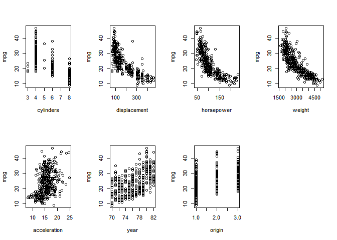<!-- -->


由图可知mpg和displacement、horsepower、weight之间呈现负相关的关系，但是和cylinders、acceleration、year、origin之间呈现正相关的关系。


（f）假设需要一些变量预测mpg(每英里汽油消耗量)。图中是否提供了一些可用来预测 mpg 的预测变量的线索?证实你的回答。


图中可以看出不同的变量和mpg的正负相关关系，且散点图越密集、趋势越明显，说明相关性越强，因此可以判断cylinders和acceleration与mpg的相关性不强，对于预测的影响不大。线性回归的结果也证实了推测：


```r
model1<-lm(mpg~.-name,Auto)
summary(model1)
```

```
##
## Call:
## lm(formula = mpg ~ . - name, data = Auto)
##
## Residuals:
##     Min      1Q  Median      3Q     Max
## -9.5903 -2.1565 -0.1169  1.8690 13.0604
##
## Coefficients:
##                Estimate Std. Error t value Pr(>|t|)
## (Intercept)  -17.218435   4.644294  -3.707  0.00024 ***
## cylinders     -0.493376   0.323282  -1.526  0.12780
## displacement   0.019896   0.007515   2.647  0.00844 **
## horsepower    -0.016951   0.013787  -1.230  0.21963
## weight        -0.006474   0.000652  -9.929  < 2e-16 ***
## acceleration   0.080576   0.098845   0.815  0.41548
## year           0.750773   0.050973  14.729  < 2e-16 ***
## origin         1.426141   0.278136   5.127 4.67e-07 ***
## ---
## Signif. codes:  0 '***' 0.001 '**' 0.01 '*' 0.05 '.' 0.1 ' ' 1
##
## Residual standard error: 3.328 on 384 degrees of freedom
## Multiple R-squared:  0.8215,	Adjusted R-squared:  0.8182
## F-statistic: 252.4 on 7 and 384 DF,  p-value: < 2.2e-16
```

10. 本习题是关于 Boston 房屋数据集的。


（a）开始载入Boston 数据集。 Boston 数据集是 MASS 软件包中的一部分。
 > library(MASS)

现在这个软件包含有数据对象 Boston 。

> Boston

读这个数据:
> ?Boston

这个数据有多少行?多少列?行和列分别代表什么?

```r
library(MASS)
?Boston
```

```
## starting httpd help server ... done
```

数据框有506行和14列。
数据框的行代表不同的郊区样本。
数据框包含以下列：
>crim：城镇人均犯罪率.
>
>zn：占地面积超过25,000平方尺的住宅用地比例
>
>indus：每个城镇非零售业务占的比例
>
>chas：Charles River虚拟变量（如果在河流沿岸则= 1;否则为0）
>
>
>nox：氮氧化物浓度（每千万份）
>
>rm：每栋住宅的平均房间数量
>
>age：1940年以前建造的自住单位比例
>
>dis：到波士顿五个就业中心的加权平均值
>
>rad；径向高速公路的可达性指数
>
>tax：每10,000美元的全额物业税率
>
>ptratio：城镇的师生比例
>
>black：1000（Bk - 0.63）^ 2其中Bk是城镇黑人的比例
>
>lstat：较低的人口状况（百分比）
>
>
>medv：自住房屋的中位数\1000美元


（b）在该数据集里对预测变量(列)做一些成对的散点图，结合图描述你的发现。

```r
par(mfrow=c(2,4))
for (i in 2:9) {
  plot(Boston[,i],Boston[,1],xlab = names(Boston)[i],
       ylab = names(Boston)[1])
}
```

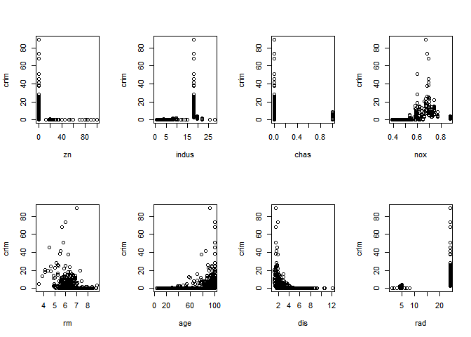<!-- -->

```r
par(mfrow=c(2,4))
for (i in 10:dim(Boston)[2]) {
  plot(Boston[,i],Boston[,1],xlab = names(Boston)[i],
       ylab = names(Boston)[1])
}
```

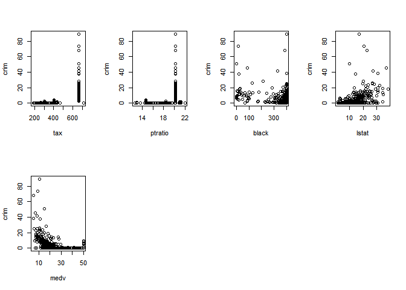<!-- -->


由图可见每个变量与crim的相关性都不强，且对于每个变量都是当其在特定取值时会是crim陡然增高，但是在其他情况下，对crim的影响不大，这说明，只有特定的人群才会有较高的犯罪率，而不是随着一些变量的变化，犯罪率也逐渐变化。


（c） 是否有一些预测变量与人均犯罪比例有关?如果有，请解释这个关系。


```r
model2<-lm(crim~.,Boston)
summary(model2)
```

```
##
## Call:
## lm(formula = crim ~ ., data = Boston)
##
## Residuals:
##    Min     1Q Median     3Q    Max
## -9.924 -2.120 -0.353  1.019 75.051
##
## Coefficients:
##               Estimate Std. Error t value Pr(>|t|)
## (Intercept)  17.033228   7.234903   2.354 0.018949 *
## zn            0.044855   0.018734   2.394 0.017025 *
## indus        -0.063855   0.083407  -0.766 0.444294
## chas         -0.749134   1.180147  -0.635 0.525867
## nox         -10.313535   5.275536  -1.955 0.051152 .
## rm            0.430131   0.612830   0.702 0.483089
## age           0.001452   0.017925   0.081 0.935488
## dis          -0.987176   0.281817  -3.503 0.000502 ***
## rad           0.588209   0.088049   6.680 6.46e-11 ***
## tax          -0.003780   0.005156  -0.733 0.463793
## ptratio      -0.271081   0.186450  -1.454 0.146611
## black        -0.007538   0.003673  -2.052 0.040702 *
## lstat         0.126211   0.075725   1.667 0.096208 .
## medv         -0.198887   0.060516  -3.287 0.001087 **
## ---
## Signif. codes:  0 '***' 0.001 '**' 0.01 '*' 0.05 '.' 0.1 ' ' 1
##
## Residual standard error: 6.439 on 492 degrees of freedom
## Multiple R-squared:  0.454,	Adjusted R-squared:  0.4396
## F-statistic: 31.47 on 13 and 492 DF,  p-value: < 2.2e-16
```


通过回归拟合可以看出，在显著性水平为0.05的情况下，还是有一些变量对crim产生一定的影响的，其中包括zn、dis、rad、black、medv。


（d）波士顿郊外的犯罪率会特别高吗?税率高吗?师生比高吗?在这个空间范围对每个预测变量进行讨论。


```r
datarange(Boston,dim(Boston)[2])
```

```
##       range
##  [1,] "crim:    0.00632-88.9762"
##  [2,] "zn:    0-100"
##  [3,] "indus:    0.46-27.74"
##  [4,] "chas:    0-1"
##  [5,] "nox:    0.385-0.871"
##  [6,] "rm:    3.561-8.78"
##  [7,] "age:    2.9-100"
##  [8,] "dis:    1.1296-12.1265"
##  [9,] "rad:    1-24"
## [10,] "tax:    187-711"
## [11,] "ptratio:    12.6-22"
## [12,] "black:    0.32-396.9"
## [13,] "lstat:    1.73-37.97"
## [14,] "medv:    5-50"
```

```r
datameanvar(Boston,dim(Boston)[2])
```

```
##       mean and var
##  [1,] "crim:    mean 3.61 var 74"
##  [2,] "zn:    mean 11.36 var 544"
##  [3,] "indus:    mean 11.14 var 47"
##  [4,] "chas:    mean 0.07 var 0"
##  [5,] "nox:    mean 0.55 var 0"
##  [6,] "rm:    mean 6.28 var 0"
##  [7,] "age:    mean 68.57 var 792"
##  [8,] "dis:    mean 3.8 var 4"
##  [9,] "rad:    mean 9.55 var 76"
## [10,] "tax:    mean 408.24 var 28405"
## [11,] "ptratio:    mean 18.46 var 5"
## [12,] "black:    mean 356.67 var 8335"
## [13,] "lstat:    mean 12.65 var 51"
## [14,] "medv:    mean 22.53 var 85"
```


可以看出每个预测变量在这个空间范围内都有很大程度的差异，其变化范围也有很大的跨度，说明不同的郊区的人生活情况非常不同。


（e） 该数据集里的郊区有多少在查尔斯河岸附近?


```r
sum(Boston$chas)
```

```
## [1] 35
```


（f）该数据集里城镇生师比的中位数是多少?


```r
median(Boston$ptratio)
```

```
## [1] 19.05
```

（g） 业主自用住房的中位数最小的波士顿郊区是哪个?该郊区其他预测变量的取值是多少，这些预测变量在各自总体的分布上是什么水平?对所发现的现象作评论。

```r
order(Boston$medv)[1]
```

```
## [1] 399
```

业主自用住房的中位数最小的波士顿郊区是第399个

```r
Boston[order(Boston$medv)[1],]
```

```
##        crim zn indus chas   nox    rm age    dis rad tax ptratio black
## 399 38.3518  0  18.1    0 0.693 5.453 100 1.4896  24 666    20.2 396.9
##     lstat medv
## 399 30.59    5
```

该城镇的数据中，对犯罪率有较重要影响的变量取值均非常极端，且其犯罪率也非常高，说明这些变量对犯罪率确实有非常强的影响。


（h）在该数据集里，有多少个郊区居民平均居住房间数量超过 7 了呢?超过 8 个房间的郊区数呢?讨论居民平均居住房间数超过 8 个的郊区特征。

```r
attach(Boston)
```

```
## The following object is masked from data (pos = 8):
##
##     age
```

```
## The following object is masked from data (pos = 9):
##
##     age
```

```r
dim(Boston[rm>7,])[1]
```

```
## [1] 64
```

```r
dim(Boston[rm>8,])[1]
```

```
## [1] 13
```
有64个郊区居民平均居住房间数量超过 7 了，超过 8 个房间的郊区数有13个。


```r
Boston[rm>8,]
```

```
##        crim zn indus chas    nox    rm  age    dis rad tax ptratio  black
## 98  0.12083  0  2.89    0 0.4450 8.069 76.0 3.4952   2 276    18.0 396.90
## 164 1.51902  0 19.58    1 0.6050 8.375 93.9 2.1620   5 403    14.7 388.45
## 205 0.02009 95  2.68    0 0.4161 8.034 31.9 5.1180   4 224    14.7 390.55
## 225 0.31533  0  6.20    0 0.5040 8.266 78.3 2.8944   8 307    17.4 385.05
## 226 0.52693  0  6.20    0 0.5040 8.725 83.0 2.8944   8 307    17.4 382.00
## 227 0.38214  0  6.20    0 0.5040 8.040 86.5 3.2157   8 307    17.4 387.38
## 233 0.57529  0  6.20    0 0.5070 8.337 73.3 3.8384   8 307    17.4 385.91
## 234 0.33147  0  6.20    0 0.5070 8.247 70.4 3.6519   8 307    17.4 378.95
## 254 0.36894 22  5.86    0 0.4310 8.259  8.4 8.9067   7 330    19.1 396.90
## 258 0.61154 20  3.97    0 0.6470 8.704 86.9 1.8010   5 264    13.0 389.70
## 263 0.52014 20  3.97    0 0.6470 8.398 91.5 2.2885   5 264    13.0 386.86
## 268 0.57834 20  3.97    0 0.5750 8.297 67.0 2.4216   5 264    13.0 384.54
## 365 3.47428  0 18.10    1 0.7180 8.780 82.9 1.9047  24 666    20.2 354.55
##     lstat medv
## 98   4.21 38.7
## 164  3.32 50.0
## 205  2.88 50.0
## 225  4.14 44.8
## 226  4.63 50.0
## 227  3.13 37.6
## 233  2.47 41.7
## 234  3.95 48.3
## 254  3.54 42.8
## 258  5.12 50.0
## 263  5.91 48.8
## 268  7.44 50.0
## 365  5.29 21.9
```

```r
datarange(Boston[rm>8,],dim(Boston)[2])
```

```
##       range
##  [1,] "crim:    0.02009-3.47428"
##  [2,] "zn:    0-95"
##  [3,] "indus:    2.68-19.58"
##  [4,] "chas:    0-1"
##  [5,] "nox:    0.4161-0.718"
##  [6,] "rm:    8.034-8.78"
##  [7,] "age:    8.4-93.9"
##  [8,] "dis:    1.801-8.9067"
##  [9,] "rad:    2-24"
## [10,] "tax:    224-666"
## [11,] "ptratio:    13-20.2"
## [12,] "black:    354.55-396.9"
## [13,] "lstat:    2.47-7.44"
## [14,] "medv:    21.9-50"
```

```r
datameanvar(Boston[rm>8,],dim(Boston)[2])
```

```
##       mean and var
##  [1,] "crim:    mean 0.72 var 1"
##  [2,] "zn:    mean 13.62 var 692"
##  [3,] "indus:    mean 7.08 var 29"
##  [4,] "chas:    mean 0.15 var 0"
##  [5,] "nox:    mean 0.54 var 0"
##  [6,] "rm:    mean 8.35 var 0"
##  [7,] "age:    mean 71.54 var 606"
##  [8,] "dis:    mean 3.43 var 4"
##  [9,] "rad:    mean 7.46 var 28"
## [10,] "tax:    mean 325.08 var 12315"
## [11,] "ptratio:    mean 16.36 var 6"
## [12,] "black:    mean 385.21 var 111"
## [13,] "lstat:    mean 4.31 var 2"
## [14,] "medv:    mean 44.2 var 65"
```

```r
detach(Boston)
```


在与犯罪率关系较强的变量中，这些郊区的数据更优，呈现出更好的城市面貌，使得犯罪率较其他数据有非常明显的下降。