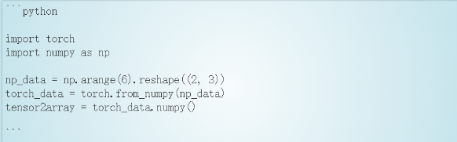

本模板用于向IT部提交markdown的格式规范，各小组提交markdown文档可在Rmarkdown中试运行。标题，段落严格按照模板格式标注，其中各类模块按小组报告需求添加，目的在于使得小组报告更为简洁明了，美观大方。

## 1 标题

{==标题的markdown代码如下，在标题符号#后面请记得加一个空格，而加粗符号中间不要空格==}

``` markdown
## 一级标题（1 绪论）

### 二级标题（1.1 背景介绍）

#### 三级标题（1.1.1 国内现状介绍）

再细分的内容采用 **(1)细分内容代替**
```

{==代码在界面中展示结果如下==}

## 一级标题（1 绪论）

### 二级标题（1.1 背景介绍）

#### 三级标题（1.1.1 国内现状介绍）

再细分的内容采用 **(1)细分内容代替**

## 2 段落

(1)段落首行不需要缩进

(2)每个标题代码后面,段落后面统一空一行表示另起一段，以防回车识别不出

{==例如，markdown代码如下==}

``` markdown
### 2.1 背景介绍

Markdown 是一个 Web 上使用的文本到 HTML 的转换工具，可以通过简单、易读易写的文本格式生成结构化的 HTML 文档。

目前 github、Stackoverflow、 知乎等网站均支持这种格式。而在我们的常用工具中，如 Jupyter Notebook、R Studio 也均支持了 Markdown。如今 Markdown 的使用范围也远不止 Web 上 HTML 生成，它凭借着优秀的排版效果、使用体验和跨平台支持，在学术界也开始备受青睐。
```

{==在页面中展示的结果如下==}

### 2.1 背景介绍

Markdown 是一个 Web 上使用的文本到 HTML 的转换工具，可以通过简单、易读易写的文本格式生成结构化的 HTML 文档。

目前 github、Stackoverflow、 知乎等网站均支持这种格式。而在我们的常用工具中，如 Jupyter Notebook、R Studio 也均支持了 Markdown。如今 Markdown 的使用范围也远不止 Web 上 HTML 生成，它凭借着优秀的排版效果、使用体验和跨平台支持，在学术界也开始备受青睐。

## 3 区块引用

{==对名词或概念解释时可以用区块让版面更清晰，区块代码如下。==}

``` markdown
**markdown**

> Markdown 是一个 Web 上使用的文本到 HTML 的转换工具，可以通过简单、易读易写的文本格式生成结构化的 HTML 文档。
```

{==在页面中展示的结果如下==}

**markdown**

> Markdown 是一个 Web 上使用的文本到 HTML 的转换工具，可以通过简单、易读易写的文本格式生成结构化的 HTML 文档。

## 4 序列

(1)无序序列

{==代码如下，其中的*可以用+或-代替==}

``` markdown
* 早饭
* 午饭
* 晚饭
```

{==在页面显示结果如下==}

* 早饭
* 午饭
* 晚饭

(2)段落列表

{==代码如下，第一项中有一段，第二项中两段，这里段落前面打制表符Tab==}

``` markdown
1.	Markdown的概念： 是一个 Web 上使用的文本到 HTML 的转换工具，可以通过简单、易读易写的文本格式生成结构化的 HTML 文档。

2.	现如今的Markdown:如今 Markdown 的使用范围也远不止 Web 上 HTML 生成，它凭借着优秀的排版效果、使用体验和跨平台支持，在学术界也开始备

	目前 github、Stackoverflow、 知乎等网站均支持这种格式。而在我们的常用工具中，如 Jupyter Notebook、R Studio 也均支持了 Markdown。
```

{==展示结果如下==}

1.	Markdown的概念： 是一个 Web 上使用的文本到 HTML 的转换工具，可以通过简单、易读易写的文本格式生成结构化的 HTML 文档。

2.	现如今的Markdown:如今 Markdown 的使用范围也远不止 Web 上 HTML 生成，它凭借着优秀的排版效果、使用体验和跨平台支持，在学术界也开始备

	目前 github、Stackoverflow、 知乎等网站均支持这种格式。而在我们的常用工具中，如 Jupyter Notebook、R Studio 也均支持了 Markdown。

## 5 代码区块

{==示例如下,使用三个`,后面根据语言不同可写成python,r,markdown等，如果反映输出结果可不写。==}

<center></center>

{==页面展示结果为==}

```python

import torch
import numpy as np

np_data = np.arange(6).reshape((2, 3))
torch_data = torch.from_numpy(np_data)
tensor2array = torch_data.numpy()

```

## 6 数学公式

Markdown公式插入请参考这个网页：[Markdown公式编辑学习笔记](https://www.cnblogs.com/q735613050/p/7253073.html)

需要特别注意的是行内公式两个$ 中不能有空格，而行间公式的$$符号公式的左右至少要有一个空格。

{==行内公式==}

``` markdown
行内公式：$p(x|y) = \frac{p(y|x)p(x)}{p(y)}$
```

{==展示结果==}

行内公式：$p(x|y) = \frac{p(y|x)p(x)}{p(y)}$

{==行间公式==}

``` markdown
行间公式：$$ \frac{n!}{k!(n-k)!} = \binom{n}{k}$$
```
{==展示结果==}

行间公式：$$ \frac{n!}{k!(n-k)!} = \binom{n}{k}$$

## 7 网页链接与图片插入

(1)单个网页链接

{==下面代码的格式能让网页两个字变成括号里的链接==}

``` markdown
我们 NKDACS 的[官网](https://www.nkdacs.com)
```

{==展示结果==}

我们 NKDACS 的[官网](https://www.nkdacs.com)

(2)多个网页链接

{==下面代码的格式能让中括号里的字变成各自序号代表的链接，引号中的内容是鼠标长留时显示的标签，两个中括号中间的空格不能省略==}

``` markdown
I get 10 times more traffic from [Google] [1] than from
[Yahoo] [2] or [MSN] [3].
[1]: http://google.com/     "Google"
[2]: http://search.yahoo.com/     "Yahoo Search"
[3]: http://search.msn.com/     "MSN Search"
```

{==展示结果==}

I get 10 times more traffic from [Google] [1] than from
[Yahoo] [2] or [MSN] [3].
[1]: http://google.com/     "Google"
[2]: http://search.yahoo.com/     "Yahoo Search"
[3]: http://search.msn.com/     "MSN Search"

(3)本地图片插入

本地图片需要存在与markdown文件相同的文件夹中，如下代码中files文件夹与本markdown文件在一个文件夹，插入的图片为files文件夹中的名为'1'的png类型图。左右的center为使图片居中。中括号中为对图片的描述。

{==代码==}

``` markdown
<center></center>
```

{==展示结果==}

<center></center>

(4)网上图片插入

{==代码，与单个网页链接相似，在其前加感叹号==}

``` markdown
<center></center>
```

{==展示结果==}


## 8 强调

{==代码==}


{==展示结果==}

对文字的强调有**加粗**，{==高亮==}，{--删除的文字--}，{++增加的文字++}，{>>点评<<}等

## 9 表格

{==代码，根据冒号位置确定居中与否==}

``` markdown
First Header | Second Header | Third Header
:----------- |:-------------:| -----------:
居左         | 居中        | 居右
居左         | 居中        | 居右
居左         | 居中        | 居右
居左         | 居中        | 居右
居左         | 居中        | 居右
居左         | 居中        | 居右
```

{==展示结果==}

属性名称1 | 属性名称2 | 属性名称3
:----------- |:-------------:| -----------:
居左         | 居中        | 居右
居左         | 居中        | 居右
居左         | 居中        | 居右
居左         | 居中        | 居右
居左         | 居中        | 居右
居左         | 居中        | 居右

## 10 大纲

{==网站支持下面样式的大纲，效果很棒==}

* [x] 学术分享
* [x] 教程制作
* [x] 讨论班
* [ ] 网站制作
    * [x] 基本设计
    * [x] 样式设计
    * [ ] 服务器维护
    * [ ] 正式发布
* [ ] NKDACS正式展开活动

{==它的Markdown代码如下：==}

``` markdown
* [x] 学术分享
* [x] 教程制作
* [x] 讨论班
* [ ] 网站制作
    * [x] 基本设计
    * [x] 样式设计
    * [ ] 服务器维护
    * [ ] 正式发布
* [ ] NKDACS正式展开活动
```

## 11 Note

网站支持通过特殊Markdown代码来设计如下的Note样式

{==代码==}

``` markdown
!!! note "这是一个小Note"
            可以在这个可爱的小Note中记录一些要点，这样的样式更能吸引读者的眼球，从而将你想要表达的重点凸显出来。
            Note中依然可以正常使用各种形式的Markdown。无论是数学格式还是代码格式，都能正常地包含在Note中。
```

{==展示结果==}

!!! note "这是一个小Note"
    可以在这个可爱的小Note中记录一些要点，这样的样式更能吸引读者的眼球，从而将你想要表达的重点凸显出来。
    Note中依然可以正常使用各种形式的Markdown。无论是数学格式还是代码格式，都能正常地包含在Note中。  

## 12 折叠显示

{==代码==}

``` markdown
??? note "NKDACS是由学生与老师共同参与的项目组织吗？"

    是的，NKDACS有强大的教授团体对项目组的学生进行学术指导。

默认是收起来的，当然，改为默认展开也是可以的

???+ note "NKDACS是由学生与老师共同参与的项目组织吗？"

    是的，NKDACS有强大的教授团体对项目组的学生进行学术指导。
```

可以像下面这样对部分文字进行折叠操作，通过鼠标点击可以展开/收回文字块，从而能满足一些特殊场景下的需求

{==展示结果==}

??? note "NKDACS是由学生与老师共同参与的项目组织吗？"

    是的，NKDACS有强大的教授团体对项目组的学生进行学术指导。

默认是收起来的，当然，改为默认展开也是可以的

???+ note "NKDACS是由学生与老师共同参与的项目组织吗？"

    是的，NKDACS有强大的教授团体对项目组的学生进行学术指导。


## 13 注脚

注脚系统可用于参考文献的引用排版。

{==代码，同样中括号中为显示文字，圆括号中可以是网址，也可类似图片插入是本地文件位置和名称，当参考文献为本地文献时，也需要保存到相同文件夹下==}

``` markdown
本网站基于MkDocs[^1]系统，采用了Material for MkDocs[^2]主题样式，感谢开源社区的贡献！
[^1]: [https://www.mkdocs.org/](https://www.mkdocs.org/)
[^2]: [https://squidfunk.github.io/mkdocs-material/](https://squidfunk.github.io/mkdocs-material/)
```


{==下面展示注脚效果==}

本网站基于MkDocs[^1]系统，采用了Material for MkDocs[^2]主题样式，感谢开源社区的贡献！
[^1]: [https://www.mkdocs.org/](https://www.mkdocs.org/)
[^2]: [https://squidfunk.github.io/mkdocs-material/](https://squidfunk.github.io/mkdocs-material/)